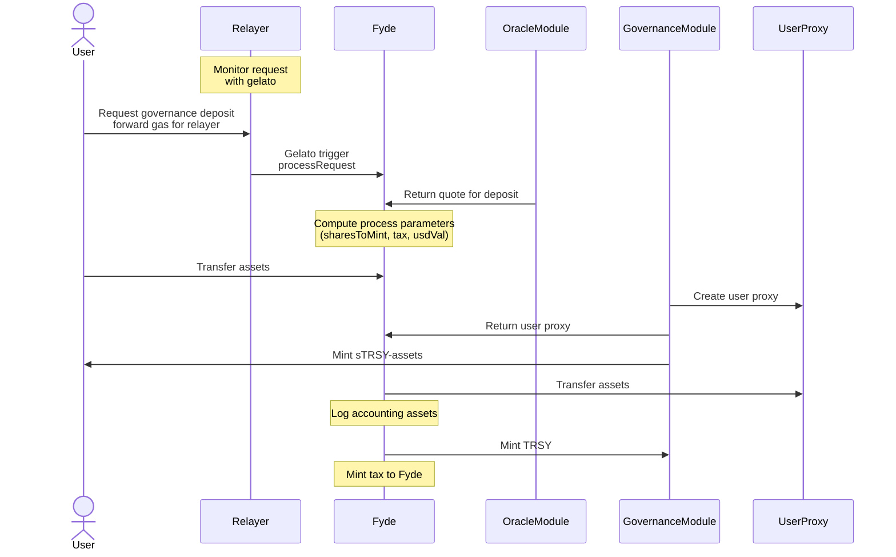

## What is Fyde ? 

Fyde Protocol introduces a trustless treasury management solution that addresses the four pillars of cryptocurrency treasury management: diversification, asset liquidity, yield generation, and governance. It tackles the DAO treasury conundrum by incentivizing users to deposit into a diversified pool of assets, while allowing for the retention of governance rights and preserving direct user control over their allocations. 

Fyde introduces an on-chain exchange pool, where tokens over a range of sub-sectors come together to compose a portfolio management strategy---tracking the market performance of each asset and implementing a dynamic weight mechanism that targets a range of volatility metrics (beta-targeting) for the pool.

## How it works ? 

TODO : Andrey can you write few lines explaining the protocol as you would for the whitepaper

## Architecture

