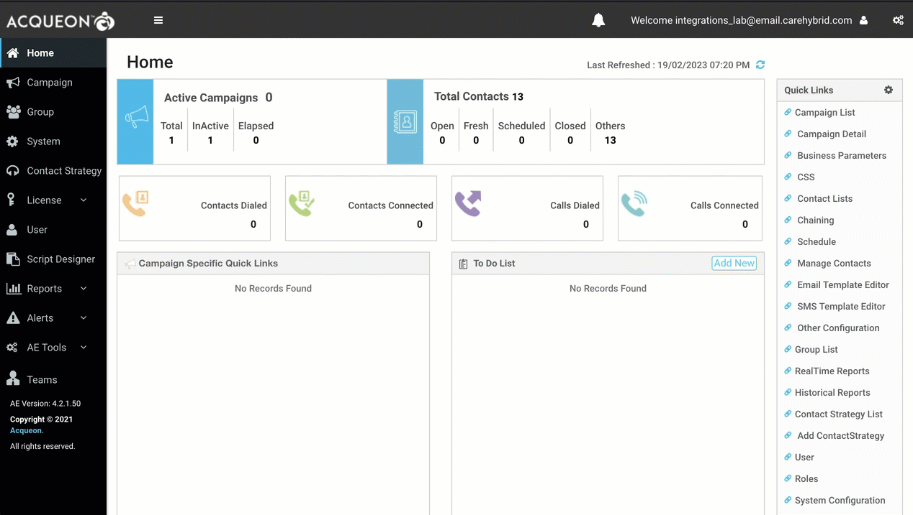
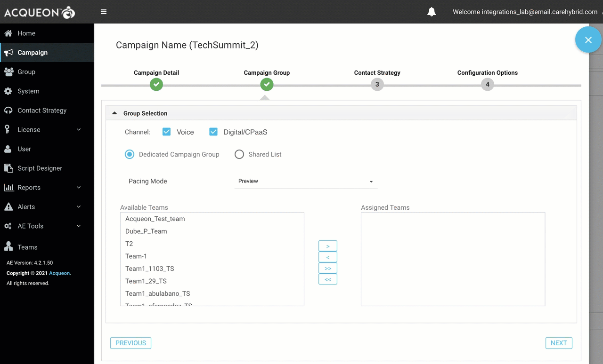
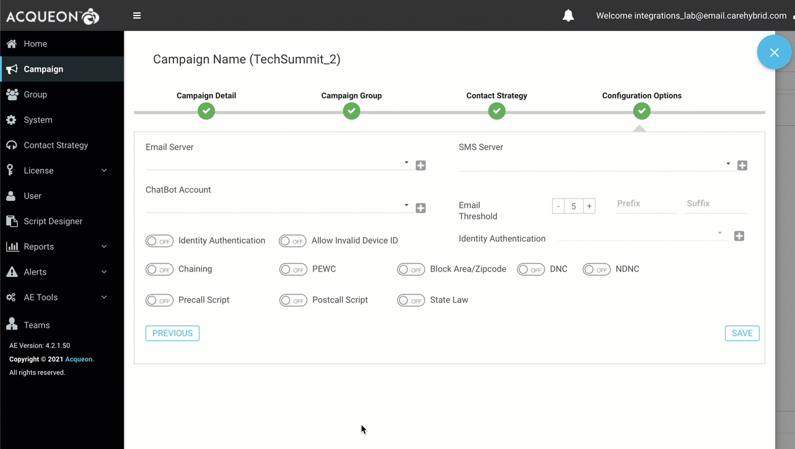
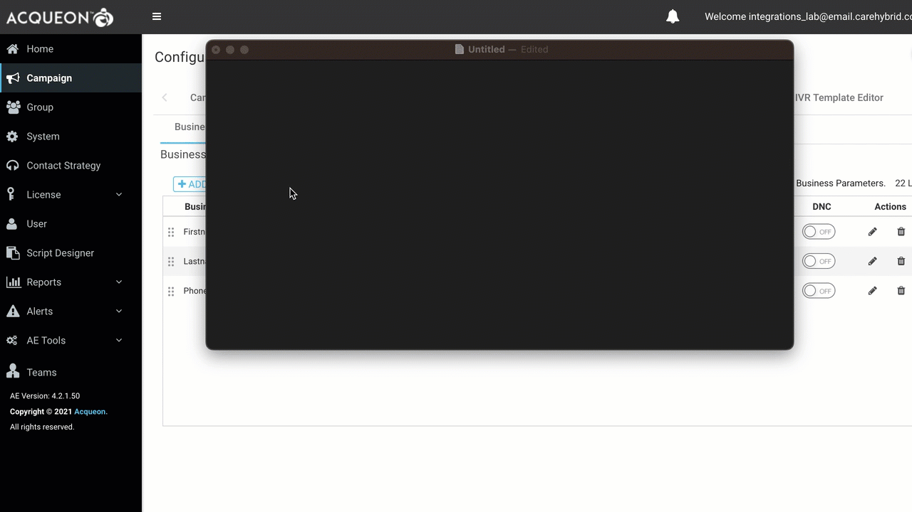
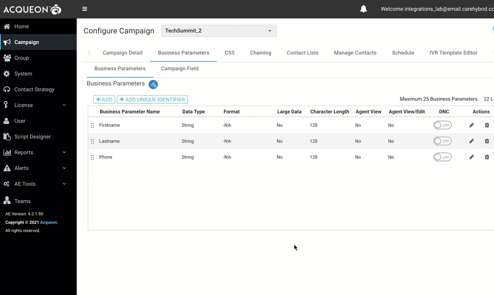
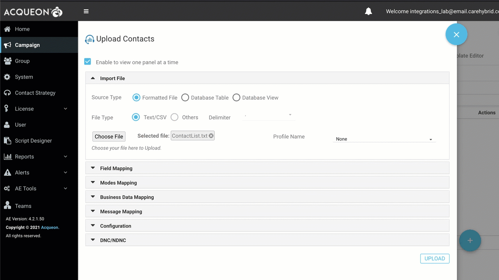
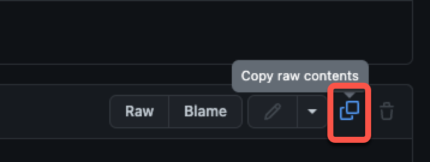
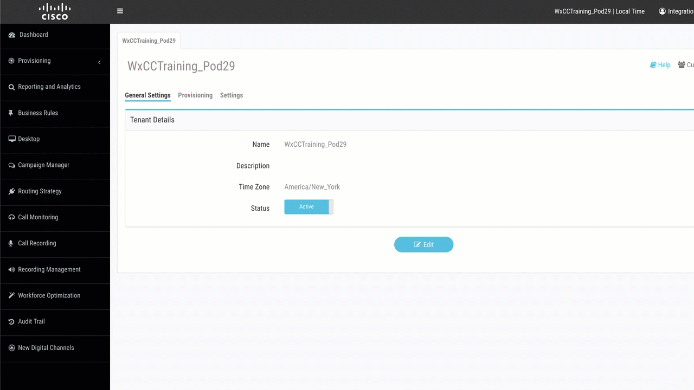
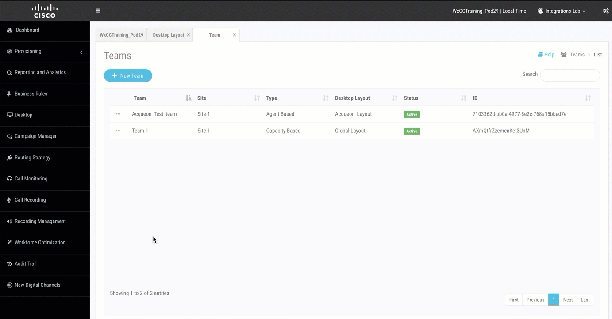
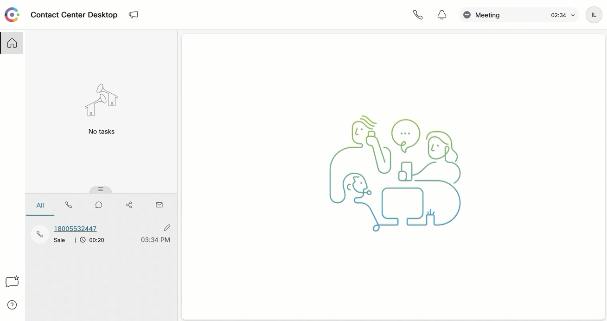

# Introduction
In this lab you will learn about configuring Webex Contact centre to manage outbound preview campaigns using the LCM (List and Campaign Manager) application.
# Lab Objective
1. Configure Webex Contact Centre and LCM (List and Campaign Manager) application
2. Verify that the Agents can initiate and make outbound campaign calls from the Agent Desktop

# Lab Pre-requisites
In this lab tenant, the tenant provisioning and integration is already completed. If you are using a different tenant, you can configure and use outbound campaigns only if your enterprise has purchased the Acqueon SKU and provisioning, integration is completed. 

# Lab Section

## Step 1. Create a team and add your agent

`This step should have been completed as part of previous lab sections. If not already done, please create a team and add your agent to this new team`
  
## Step 2. Create Campaign

- Login to administration portal and launch the 'Campaign Manager' portal 

  

- Navigge to 'Campaign' and click 'Add Campaign' button

  

- Enter the following details and click 'Next' : 
  - Campaign name : "Enter a desired name"
  - Select "Business Outcome Group": `Select Wrapup Code`
  - Select Date Range: `Select a desired date range`
  - Select Time Range: `Select a desired time duration when campaign should be active`
  - Select TimeZone: `Select a desired time zone`

  

- Uncheck "Digital/CPaaS" option and from the list of available teams, select your respective team and add it under the "Assigned Teams" section. Click "Next"   

  

- Select the contact strategy as "Default_Simple_Strategy" and select the Callback Strategy as "Default_Callback_Strategy" and click "Next"

  

- Click "Save" and verify that you receive the message "Campaign created successfully"

  

## Step 3. Create Business Parameters
- Select the campaign created in previous step 
- Navigate to "Business Parameters", click "ADD" and add the below parameters
  - Firstname 
  - Lastname
  - Phone

  

## Step 4. Create and Upload Contact List 

- Create a text file with comma seperated values as shown in the video below 
- The first row in the file should be : Firstname,Lastname,Phone
- The second row in the file should be: Test,Agent1,<`Any US phone number of your choice`>
- Save the file 

  

- Navigate to "Contact Lists" section 
-  Click on the "+" sign at the bottom right and click "Upload Contacts"
-  Verify "Source Type" is `Formatted File`
-  Verify "File Type" is `Text/CSV` and "Delimiter" is `,`
-  Click "Choose File" and select the file created in the previous step

  

- Navigate to "Field Mapping", select "ZoneName" as `Campaign Specific TimeZone`
- Navigate to "Modes Mapping", select "Mobile" as `Phone`
- Navigate to "Business Data Mapping", select "Firstname" as `Firstname`, "Lastname" as `Lastname` and "Phone" as `Phone`
- Click "Upload"
- Click "Refresh" and verify that the list shows up under the list of records

  

## Step 5. Upload a new desktop layout

- Download the desktop layout provided here: https://github.com/WebexCC/webexcc.github.io/blob/master/assets/Acqueon_Desktop_Layout.json
- If you are unable to download the file, use the `Copy raw contents` options to copy the content and past it in a text file in your desktop. Save it as a JSON file. 

  

- Login to the administration portal, Navigate to Provisioning > Desktop Layout > Click "New Layout"
- In the "Name" field: `Enter a desired name`
- Click "Upload" and select the layout downloaded earlier
- Click "Save"

  

## Step 6. Assign the new layout to your team

- Navigate to Team and edit your respective team 
- In the "Desktop Layout" field, select the new desktop layout created in previous step

  

## Step 7. Login to Agent desktop and verify Campaign Manager option 

- Login to desktop with agent credentials
- Agent dekstop URL: https://desktop.wxcc-us1.cisco.com/
- Next to the agent desktop title, verify that the `Campaign Contact` is visible 

  

## Step 8. Accept the Campaign Contact

- Make the agent available 
- Click `Campaign Contact` and accept the preview contact 

  

<strong>Congratulations, you have completed this lab! You can continue with the next one.</strong>

		

	
