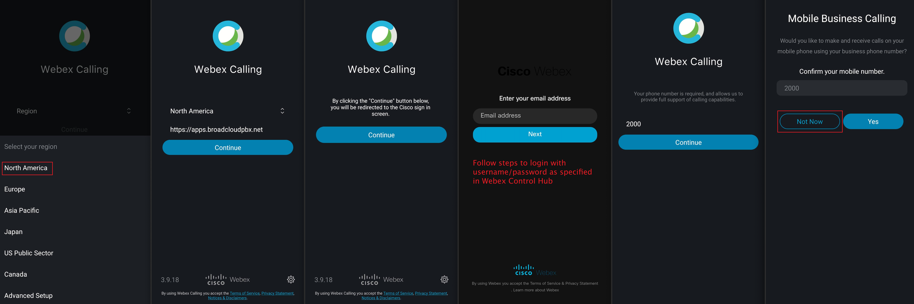

### Overview of the lab:

<form method="post">
	<label for="attendee-id">Attendee ID</label>
	<input name="attendee-id" type="text" size="20">		
	<button type="submit" name="save">SAVE</button>
</form>  
<script src="http://code.jquery.com/jquery-latest.js"></script>
<script type="text/javascript" src="/assets/gitbook/form.js"></script>


In this Lab, we will go through the tasks that are required to complete the general pre-configuration of a tenant. These tasks are to be undertaken by a customer administrator. By following each of the steps, you would have prepared your tenant to begin configuring different services offered by the platform. At the end of the lab, you should be able to log in to an agent interface with the configured user extension.
```
> ##### TIP
>
> It is assumed that the attendee has already an access to the tenant.**
{: .block-tip }
```


> ##### TIP
>
> It is assumed that the attendee has already an access to the tenant.**
{: .block-tip }


> ##### TIP
>
> It is assumed that the attendee has already an access to the tenant.**
{: .block-warning }


> ##### TIP
>
> It is assumed that the attendee has already an access to the tenant.**
{: .block-danger }

## Table of Contents

- [Part 1: Control Hub User Management Admin Task](#part-1-control-hub-user-management-admin-task) 
  * [1. Add an agent and a supervisor users and configure the calling extension](#1-add-an-agent-and-a-supervisor-users-and-configure-the-calling-extension)
  * [2. Optionally, add the rest of the users](#2-optionally-add-the-rest-of-the-users)
- [Part 2: Admin Portal Multimedia Profile, Site and Team Configuration](#part-2-admin-portal-multimedia-profile-site-and-team-configuration)
  * [1. Create new MultiMedia Profile](#1-create-new-multimedia-profile)
  * [2. Create new Site](#2-create-new-site)
  * [3. Create new Team 1](#3-create-new-team-1)
  * [4. Create new Team 2](#4-create-new-team-2)
- [Part 3: Admin Portal User Configuration](#part-3-admin-portal-user-configuration)
  * [1. Synchronize Webex Contact Center Users](#1-synchronize-webex-contact-center-users)
  * [2. Manage settings for existing user](#2-manage-settings-for-existing-user)
- [Part 4: Access to the Agent Desktop](#part-4-access-to-the-agent-desktop)
  * [1. Activate Webex Calling](#1-activate-webex-calling)
  * [2. Download and Login in the Webex Calling app for PC or Mac](#2-download-and-login-in-the-webex-calling-app-for-pc-or-mac)
  * [3. Download and Login in the Webex Calling app for mobile](#3-download-and-login-in-the-webex-calling-app-for-mobile)
  * [4. Agent Desktop Login](#4-agent-desktop-login)
- [Part 5: BONUS Tenant Creation Walkthrough](#part-5-bonus-tenant-creation-walkthrough)
- [Part 6: Bonus Video Only Trial Tenant Setup](#part-6-bonus-trial-tenant-setup-video)

## Introduction

### Lab Objective

- This lab is designed to help you do the initial setup and configuration for your GOLD tenant and to be familiar with the control hub and admin portal UI.
- The lab contains multiple exercises on Control Hub and Admin Portal to make you comfortable with the Webex Contact Center application.

### Pre-requisites

- You have Admin access to Control Hub and can create your GOLD tenant OR already have a GOLD Tenant created


### Quick Links

> Control Hub: **[https://admin.webex.com](https://admin.webex.com){:target="_blank"}**\
> Portal: **[https://portal.wxcc-us1.cisco.com/portal](https://portal.wxcc-us1.cisco.com/portal){:target="_blank"}**\
> Agent Desktop: **[https://desktop.wxcc-us1.cisco.com](https://desktop.wxcc-us1.cisco.com){:target="_blank"}**\
> Webex Calling app **[https://settings.webex.com/](https://settings.webex.com/){:target="_blank"}**


## Lab Section

# Control Hub User Management Tasks


> The following video outlines the process to manage different types of users to the Customer tenant. Following the steps, you will add new users and set the Calling extension. While adding the user, we will see how to select user roles. 

<iframe width="1024" height="576" src="https://www.youtube-nocookie.com/embed/0p37TL5wtCY?rel=0" title="WxCC Lab #1 Part 1: Control Hub User Management Admin Task" frameborder="0" allow="accelerometer; autoplay; clipboard-write; encrypted-media; gyroscope; picture-in-picture" allowfullscreen></iframe>

| **User Role** | **User email**              | **User Extension** |
| ------------- | --------------------------- | ------------------ |
| Agent         | agent1<@youremail.com>      | <assign a DN>      |
| Supervisor    | supervisor1<@youremail.com> | <assign a DN>      |


### 1. Define your Attendee ID
<div class="alert"></div>
<form id="attendee-form">
      <label for="attendee-id">Attendee ID</label>
      <input type="text" name="attendee-id" id="attendee-id" />
      <button type="submit" id="save">SAVE</button>
</form>
<script src="/assets/gitbook/form.js"></script>
	
### 1. Add an agent and a supervisor users and configure the calling extension

- Login to the [Control Hub](https://admin.webex.com){:target="_blank"} with the admin account.

- Navigate to **_Users_**.

- Click on **_Manage Users_** button.

- Click on **_Manually Add or Modify User_**.

- Select **_Next_** in **_Manage Users_** pane.

- Input the **Email addresses** of the agent and supervisor users and click **_Next_**. 
	- Users and email addresses should have already been created for the purpose of these exercises.  

- For consistency, verify that the **Email addresses** are same as in the table above and click **_Next_**.  *(this step is not mandatory but will help with the consistency of the labs)*

- Check **_Messaging_** , **_Webex Calling (Professional)_** & **_Contact Center_**.

- Ensure that the License Type is **_Premium Agent_** and Role is **_Agent_** and click **_Next_**. 

- On the next page, make sure that the **_Location_** is selected under **_Assign Numbers_**. The correct value should be already selected by default. 

- The **_Phone Number_** left as **None**.

- On the same page, Enter the correct `Extension` under **_Assign Numbers_**. You can find this in the table above.

- Click **_Finish_**.

- On the next page, you should get confirmation **"2 Total records processed"**. Confirm the same by pressing **_Finish_**.

- Select the supervisor user and modify his role to **_Supervisor_** by clicking the top **_Edit_** button in front of **_Services_**. Click **_Save_** to confirm the changes.

- Validate the users by going to the assigned email account you chose for agent or supervisor and follow the **Cisco Webex** instructions to activate

- Refresh the **_Users_** page in the Control Hub, make sure that all users are in **Active** status.

### 2. Optionally, add the rest of the users

- Follow the same steps as above to add any extra users that you want to add to the Contact Center.

[To top of this lab](#table-of-contents)


# Managment Portal User Configuration

> The following video outlines how to access the admin portal and navigate the different configuration menus to create a Site, Team, and Multimedia Profile that will be assigned to the Contact Center user. We will also see how to navigate to the Webex Contact Center Management Portal from Control Hub UI.

<iframe width="1024" height="576" src="https://www.youtube-nocookie.com/embed/92ou5Yias-8?rel=0" title="WxCC Lab #1 Part 2: Admin Portal Multimedia Profile, Site and Team Configuration" frameborder="0" allow="accelerometer; autoplay; clipboard-write; encrypted-media; gyroscope; picture-in-picture" allowfullscreen></iframe>

| **Entity**          | **Name** |
| ------------------- | -------- |
| Multimedia Profiles | MMP_2022_TS   |
| Site                | Site_2022_TS  |
| Team1               | Team1_2022_TS |
| Team2               | Team2_2022_TS |

> **NOTE:** Multiple \<ID\> were provided in the email in the **"Attendee ID"** line. You can share your tenant with the multiple administrators in your organization, in that case the ID should be unique for each user.

### 1. Create new MultiMedia Profile

- Login to Control Hub by accessing [https://admin.webex.com](https://admin.webex.com){:target="\_blank"}.

- Enter the admin email id and the password.

- Navigate to **_Contact Center_** Card.

- Click **_Settings_** in the upper right corner.

- Scroll down to the **_Advanced Configuration_** section.

- Click on **_Go to Webex Contact Center Management Portal_**.

- Ensure that browser pop up blockers are not blocking the **_Admin Portal_** pop up.

- Click on **_Provisioning_** and select **_Multimedia Profiles_**.

- Click on `+ New Multimedia Profile` to open Multimedia Profile configuration page.

- Input Name as `MMP_2022_TS`.

- In the Media Details section, select the blended multimedia profile and input `1` for **_Voice_**, `3` for **_Chat_**, `3` for **_Email_**, and click **_Save_**.

### 2. Create new Site

- Navigate to **_Provisioning_** and select **_Site_**.

- Click on `+ New Site` button and provide the Name as `Site_2022_TS`.

- Select `MMP_2022_TS` in the **_Multimedia Profile_** drop down and hit **_Save_**.

### 3. Create new Team 1

- Navigate to **_Provisioning_** and select **_Team_**.

- Click on `+ New Team`.

- Select `Site_2022_TS` from the **_Site_** drop-down.

- Input **_Name_** as `Team1_2022_TS`.

- Use the default **_Type_** `Agent Based`.

- Select `MMP_2022_TS` in the **_Multimedia Profile_** drop-down.

- Left as a default value **_Global Layout_** in the **_Desktop Layout_** drop-down and hit **_Save_**.

### 4. Create new Team 2

- Please follow the same steps as above to add an extra Team as `Team2_2022_TS`. Later we will use this team to assign a custom Desktop Layout.


> The following video outlines how to configure the users in Admin Portal that were added first in Control Hub. This is a very critical task from the Contact Center perspective. We also would take a look at how to associate customer-created Site, Team, and Multi-Media Profile with those users. After this, we should be able to login as an agent.

<iframe width="1024" height="576" src="https://www.youtube-nocookie.com/embed/r_A-BPhoTaA?rel=0" title="WxCC Lab #1 Part 3: Admin Portal User Configuration" frameborder="0" allow="accelerometer; autoplay; clipboard-write; encrypted-media; gyroscope; picture-in-picture" allowfullscreen></iframe>

### 1. Synchronize Webex Contact Center Users

- Login to Control Hub by accessing [https://admin.webex.com](https://admin.webex.com){:target="\_blank"}.

- Enter the admin email id and the password.

- Navigate to **_Contact Center_** card.

- Click on **_Settings_** and then `Synchronize Users`.

### 2. Manage settings for existing user

- Go back to the **_Webex Contact Center Management Portal_**.

- Click on **_Provisioning_** and select **_Users_**.

- Click on `...` for the first user, to launch the **_Edit_** view for a particular User configuration.

- Click on **_Contact Center Enabled_** toggle to move it to **_On_**.

- In the **_Agent Settings_** section, select `Site_2022_TS` in the **_Site_** drop-down.

- Click the **_Teams_** area and select `Team1_2022_TS` and `Team2_2022_TS`.

- Select `MMP_2022_TS` in the **_Multimedia Profile_** drop-down and hit **_Save_**.

- Make sure that the user are now shown with the **_Contact Center Enabled_** flag as `Yes` and **_Status_** as `Active`.


# Access to the Agent Desktop
>The following video explains the process to access the Agent Desktop. Following the steps, you will log in with your credentials and indicate the number where you want to receive the calls. 

<iframe width="1024" height="576" src="https://www.youtube-nocookie.com/embed/2bmoiAfxpTU?rel=0" title="WxCC Lab #2 Part 4: Access to the Agent Desktop" frameborder="0" allow="accelerometer; autoplay; clipboard-write; encrypted-media; gyroscope; picture-in-picture" allowfullscreen></iframe>


### 1. Activate Webex Calling

- Login the **[Control Hub](https://admin.webex.com/){:target="_blank"}** with your admin credentials.

- Navigate to **_Users_**.

- Select the **Agent** user 

- In the User settings, make sure that the following **_Services_** are listed:
   -  **_Messaging_** as **Advanced Messaging**.
   -  **_Calling_** as **Webex Calling (Professional)**.
   -  **_Contact Center_**.

- Scroll down to **_Calling Behaviour_** and select **_Webex Calling app_**. Click **_Save_**.

- Repeat the same steps for **Supervisor** user. Make sure that **_Webex Calling app_** has been activated.

### 2. Download and Login in the Webex Calling app for PC or Mac

> **Note:** You need two Webex Calling app for placing a call to Entry Point and accepting on the agent side. Alternatively, if you have a US number, you can use it as an agent's extension. This tenant does not allow numbers outside of the United States. In this lab, we will use the Webex Calling app for PC or Mac for **agent** account.

- Login to **[https://settings.webex.com/](https://settings.webex.com/){:target="_blank"}** by using account `agent1`.

- Click on **_Webex Calling_** this will cross launch CUP in a new browser tab.

- Go to **_My Apps_**.

- Click `Download` the Webex Calling Client **Desktop Software**.

- Install the application on your PC/Mac.

- Open Webex Calling and сlick **Sign In**. Specify the agent credentials for `agent1`.

- Depending on your operation system, navigate to the Webex Callin Menu **_Edit Server Address_** and make sure you have selected **North America** region.

### 3. Download and Login in the Webex Calling app for mobile

> **Note:** You need two Webex Calling app for placing a call to Entry Point and accepting on the agent side. In this lab, we will use the Webex Calling app for mobile for **supervisor** account.

- Open the Application Manager (**Play Store** or **App Store**) on your mobile phone.

- Search for **_webex calling_**.

- **Download** and **Open** the app. Click `Get Started`.

- Login in the app by selecting **_Region_** as **North America**.

- Set **_Email address_** and **_Password_** as the supervisor account `supervisor1`.

> **Note:** Make sure that you give access to the phone's microphone for the calling app.



### 4. Agent Desktop Login
> **Note**: To log in to the agent desktop, use either a separate web browser or a new incognito web page. This will prevent any browser caching issues with admin and agent credentials.

- Navigate to **[https://desktop.wxcc-us1.cisco.com/](https://desktop.wxcc-us1.cisco.com/){:target="_blank"}** in a new browser or in incognito mode.

- Enter the agent’s **email ID** `agent1` which you created in the previous lab.

- Enter the **Password** for the appropriate Username.

- In the **_Station Login_** pane, select **"Extension"** and input the configured number for that user. 

> **Note:** Please use Webex Callin Extension for this lab. Optionally, if you have a US number, you can use it from the agent's desktop. This tenant does not allow numbers outside of the United States.

- Select the `Team1_2022_TS`, with default desktop layout.

- Click **_Submit_**. Make sure that you are successfully logged in to the Agent Desktop. Now you can continue with the next section.

# Bulk Configuration


---


<p style="text-align:center"><strong>Congratulations, you have completed this lab! You can continue with the next one.</strong></p>
		
<p style="text-align:center;"></p>	
	

