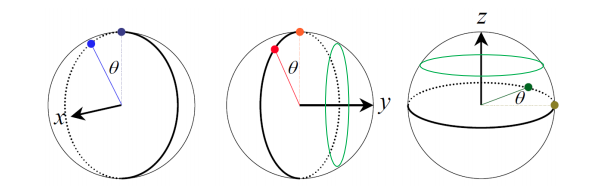
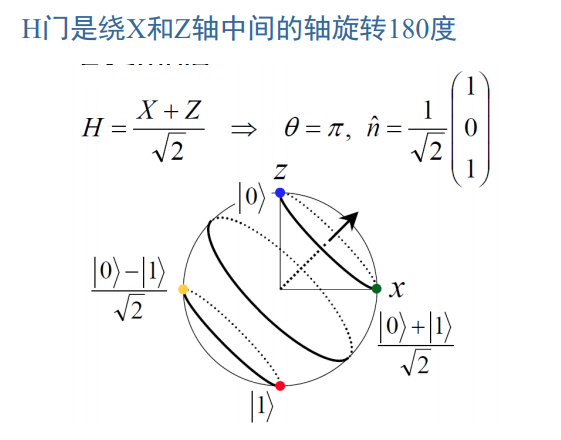

<head>
    
    
</head>

## 基础知识

$$\mid 0 \rang = \binom{0}{1} \qquad |1 \rang = \binom{1}{0}$$
$$\lang 0 \mid = (0 \enspace 1) \qquad \lang 1| = (1 \enspace 0)$$

## 量子电路

### 回顾

+ 所有量子操作对应于一个酉矩阵（幺正矩阵） *U*

+ 量子操作具有并行性
$$U[|ψ\rang = \sum^{N-1}_{i=0}{a_i |i\rang}] = \sum^{N-1}_{i=0}{a_iU|i\rang}$$

+ 对量子比特最基本的操作称为**逻辑门**：逻辑门的操作按照它对Hilbert空间基矢的作用来定义

### 单量子比特门（一位门）

#### Pauli门{X, Y, Z}

##### 定义

$$X = \mid 0 \rang \lang 1 \mid + \mid 1\rang \lang 0 \mid = 
\begin{pmatrix}
0 & 1 \\
1 & 0
\end{pmatrix},\quad X(α|0\rang+β|1\rang) = α|1\rang + β|0\rang$$
$$Z = |0\rang\lang0| - |1\rang\lang1| = 
\begin{pmatrix}
1 & 0 \\
0 & -1
\end{pmatrix},\quad Z(α|0\rang+β|1\rang) = α|0\rang - β|1\rang$$
$$Y = -i|0\rang\lang1| + i|1\rang\lang0| = 
\begin{pmatrix}
0 & -i \\
i & 0
\end{pmatrix},\quad Y(α|0\rang+β|1\rang) = iα|1\rang - iβ|0\rang$$

$$
Y=iXZ \qquad XYZ=i
\\
X^2=Y^2=Z^2=I=
\begin{pmatrix}
1 & 0\\
0 & 1
\end{pmatrix}
$$

#### H, S, T门

Hadamard门

$$
H = \frac{1}{\sqrt{2}}[(|0\rang+|1\rang)\lang0| + (|0\rang-|1\rang)\lang1|]
\\ = \frac{1}{\sqrt{2}}
\begin{pmatrix}
1 & 1 \\
1 & -1
\end{pmatrix}
$$

两个Hadamard门串联，电路的净效应与量子线完全相同。

$$
H^2 = I
$$

$$
H = \frac{(X+Z)}{\sqrt{2}} \\
HXH=Z,\quad HYH=-Y,\quad HZH=X
$$

S, T门

$$
S = 
\begin{pmatrix}
1 & 0\\
0 & i
\end{pmatrix}
\qquad
T = 
\begin{pmatrix}
1 & 0\\
0 & e^{\frac{iπ}{4}}
\end{pmatrix}
\\
S=T^2
S^2=Z
$$

#### 旋转门

**矩阵函数的一般化定义**

对可对角化的矩阵A（酉矩阵、厄米矩阵等），设

$$
A=P
\begin{bmatrix}
λ_1 & ... \\
...& λ_n
\end{bmatrix}
P^{-1}
$$

则有

$$
f(A)=P
\begin{bmatrix}
f(λ_1) & ... \\
...& f(λ_n)
\end{bmatrix}
P^{-1}
$$

根据以上一般化定义，可得

$$
R_{X}(θ)\equiv e^{\frac{-iθX}{2}},
\quad
R_{Y}(θ)\equiv e^{\frac{-iθY}{2}},
\quad
R_{Z}(θ)\equiv e^{\frac{-iθZ}{2}}
$$

**特殊情况**

$$
A^2=I \quad\rArr\quad e^{iAx} = cosx \sdot I + isinx \sdot A
$$

因此，

$$R_{X}(θ)\equiv e^{\frac{-iθX}{2}} = cos\frac{θ}{2}I-isin\frac{θ}{2}X$$
$$R_{Y}(θ)\equiv e^{\frac{-iθZ}{2}} = cos\frac{θ}{2}I-isin\frac{θ}{2}Y$$
$$R_{Z}(θ)\equiv e^{\frac{-iθY}{2}} = cos\frac{θ}{2}I-isin\frac{θ}{2}Z$$

简单来说，旋转门 $R_X(θ)$ 作用在量子态 $\mid ψ\rang$ 上，在Bloch球上表现为 $\mid ψ\rang$ 所表示的向量绕x轴顺时针旋转θ角。

同理，$R_Y(θ)$ 和 $R_Z(θ)$ 分别表示绕y轴和z轴旋转。

p.s. 除了矩阵函数的一般化定义，也可用指数函数的泰勒展开形式定义

$$
e^A \equiv \sum^{∞}_{n=0}\frac{A^n}{n!}
$$

现在可以给出**绕n轴旋转θ角度的算子的定义**：

$R_n(θ)$：绕 $\bold{n}$ 轴（即向量 $(n_x,n_y,n_z)$ ）旋转 $θ$ 角

$$
R_n(θ) = e^{\frac{-iθ\bold{n\sdotσ}}{2}}=c_θI-is_θ(n_XX+n_YY+n_ZZ)
$$$$
c_θ \equiv cos\frac{θ}{2}\qquad s_θ \equiv sin\frac{θ}{2} $$$$
\bold{n} = (n_x,\enspace n_y,\enspace n_Z) $$$$
\bold{n\sdotσ} = n_XX+n_YY+n_ZZ
$$

  

### 多量子比特门（多位门）

#### 二位门：控制U门

### 通用门集合

