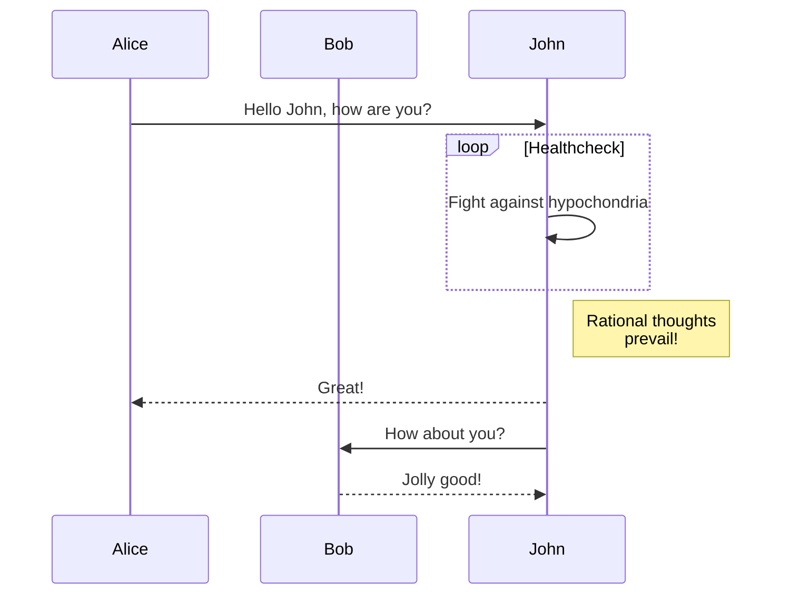

This jekyll-theme supports [mermaid.js](https://mermaid.js.org/) to render diagrams
in markdown.

To enable the mermaid support, you need to set `mermaid: true` in the front matter
of your post.

```markdown
---
title: Diagrams with mermaid.js
date: 2023-08-31
layout: post
mermaid: true
---
```

Then you can use mermaid syntax in your markdown:

```
graph TD;
    A-->B;
    A-->C;
    B-->D;
    C-->D;
```


Or, even some complex examples:

```
sequenceDiagram
    participant Alice
    participant Bob
    Alice->>John: Hello John, how are you?
    loop Healthcheck
        John->>John: Fight against hypochondria
    end
    Note right of John: Rational thoughts <br/>prevail!
    John-->>Alice: Great!
    John->>Bob: How about you?
    Bob-->>John: Jolly good!
```



Refer to the [mermaid.js website](https://mermaid.js.org/intro/) for more examples.
