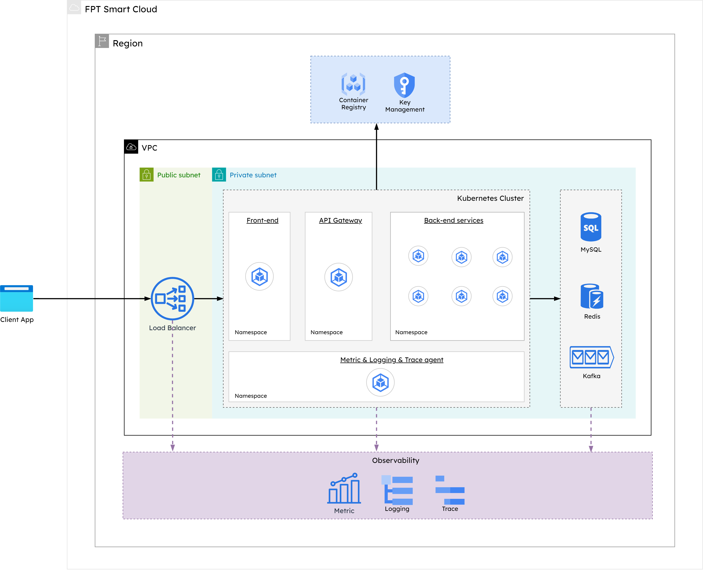

# I. Introduction

This social networking application is a website with basic functionality similar to any other social network such as:
- Creating, editing, and deleting posts and comments. Posts are categorized by topics and hashtags.
- It allows users to log in and register for an account.
- It also features community group chats for discussions between users in the social network.

The application is built based on the microservices architecture; services within the application are programmed by various programming languages such as Java, JavaScript (Nodejs), C# (.NET), Python, etc…

# II. Application Architecture

The application consists of 4 main layers:
- **Frontend**: This layer provides a graphical interface to the end users.
- **Gateway and Authentication**: This middleware layer handles requests from different clients, authenticates them, and routes them to the appropriate backend services.
- **Backend**: This layer provides services that are used to handle the application’s logic processing.
- **Storage**: This layer provides services for data storage and caching.

The list of application’s services is defined as follows:

||Services|Programming Language|Description|
|:-:|:-:|:-:|:-:|
|1|Frontend|Javascript (React)|Provides a graphical interface to the end users and sends API requests to Kong Gateway|
|2|Authentication|JavaScript (Nodejs)|APIs that are used for token authorization and determining the user’s role through tokens.|
|3|Post|Python|APIs that are used for handling logic for adding, editing, and deleting posts.|
|4|Tag|Python|APIs that are used for handling logic for adding, editing, and deleting tags|
|5|Category|Python|APIs that are used for handling logic for adding, editing, and deleting post categories.|
|6|Comment|C# (.Net)|APIs that are used for handling logic for adding, editing, and deleting a post’s comments.|
|7|Message|Java|APIs that are used for handling logic for sending messages.|
|8|Message Worker|Java|Websockets for receiving messages.|

# III. Deploying the application on FPT Smart Cloud’s PaaS

## 1. PaaS deployment architecture

## 2. Building PaaS components
### 2.1. Kubernetes
### 2.2. Container Registry
### 2.3. Kafka
### 2.4. Mysql
### 2.5. Redis
### 2.6. Load Balancing
### 2.7. Monitoring
## 3. Preparing environment variables
## 4. Deploying the application on PaaS
## 5. Configure Load Balancer
## 6. Configure Monitoring

# IV. Monitoring
## Kubernetes
## Database
## Caching
## Operating System
## Application Performance
