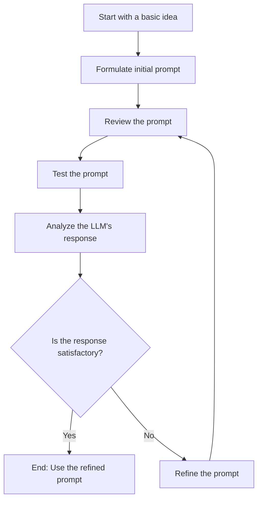

<div class="row">
  <div class="column" markdown="1">
  <div style="max-width:854px"><div style="position:relative;height:0;padding-bottom:56.25%"><iframe src="https://embed.ted.com/talks/lang/en/deb_roy_the_birth_of_a_word" width="854" height="480" style="position:absolute;left:0;top:0;width:100%;height:100%" frameborder="0" scrolling="no" allowfullscreen></iframe></div></div>

</div>

<div class="column" markdown="1">
One of my absolute favorite Ted talks that I share with _every_ new parent is called "The Birth of a Word."  It unlocked an idea for me that learning words and meaning is as much about context as it is content.
  </div>
</div>

<div class="row">
  <div class="column" markdown="1">
The vast majority of newborn experience and early child development is a race to help your child communicate with you. Help them tell you what they need or guessing better at their needs then they realize.  If you've ever had to deal with a meltdown that _magically disappears_ after a few bites of food you just experienced a child that doesn't understand when they are HANGRY.
</div>

<div class="column" markdown="1">

  </div>
</div>

What it also means is that words and the _context_ of those words matter.  With kids (and lets be honest adults too) you have to keep things simple so they actually hear what you have to say and it has to be relevant to their current situation.  Hey kids, can you make sure to put the bowl (that you're currently holding in your hand) in the sink??  On top of that you have to repeat yourself _a lot_ until they get it.  Every time you start a conversation with ChatGPT _you_ have to supply the framing and context for the specific thing you're trying to do. On top of that you have to give it as much context with as few tokens as possible in a way that isn't confusing.

<div class="row">
  <div class="column" markdown="1">
A quick aside on tokens. They aren't just letters, or spaces they're a way to convert bundles of characters (typically unicode) into integers. OpenAI has a tool for [calculating tokens](https://platform.openai.com/tokenizer) that gives a pretty good visualization. You can see the color coding can be small or large depending on the word or words.
</div>

<div class="column" markdown="1">

  </div>
</div>

You might wonder if using emojis to convey context is a way to build a higher density prompt. Asking ChatGPT to convert the original message into _just_ emojis results in 👨‍👦⚔️🪦😡👊🔜 or 👨‍👦⚔️😵👋🤺. These _almost_ feel like [rebus puzzles](https://en.wikipedia.org/wiki/Rebus) where it's a bit of a crap shoot if the reader will understand. The Tokenizer tool says that 6 emojis ultimately results in *23* and 15 characters vs the original text only being 16 tokens! The tool also adds a specific note:
> Note: Your input contained one or more unicode characters that map to multiple tokens. The output visualization may display the bytes in each token in a non-standard way.

What's important to remember here is that the tokenizer itself is a tool used to interact with the underlying model. So a bug in a tokenizer or a more sophisticated tokenizer might be better or worse at interacting with a foundational model.  Pretending that a child is a foundational language model it's equivalent to parents being able to speak to and understand their child _much better_ than a stranger. It can be easy for parents to miss a child that needs speach therapy because we've already developed a tokenizer that is _more_ compatible with the way our child speaks and communicates!  So what are strategies for building out high quality, high density prompts that more quickly get you where you want to go?

## Use markdown

Markdown is a _great_ format for conveying complex ideas that are compact. There are so many existing tools that have flavors of markdown or interperate data more seamlessly as markdown. Lets compare something as simple as making a word italicized in markdown vs html:

* Markdown
  ```md
  My name is Inigo Montoya. You killed my _father_. Prepare to die
  ```
  > 18 tokens 66 characters
* HTML
  ```html
  <p>My name is Inigo Montoya. You killed my <em>father</em>. Prepare to die</p>
  ```
  > 28 tokens 81 characters

While this is very much a toy example it is a far more compact way to convey emphasis.  There is a very specific technique that changed how I used chatgpt that is glossed over during this GPT-4 Developer Live stream.

<div class="row">
  <div class="column" markdown="1">
<iframe src="https://www.youtube.com/embed/outcGtbnMuQ?t=137" title="GPT-4 Developer Livestream" frameborder="0" allow="accelerometer; autoplay; clipboard-write; encrypted-media; gyroscope; picture-in-picture; web-share" allowfullscreen></iframe>
</div>

<div class="column" markdown="1">
Jump to time ~2:19. Did you catch it? It seems so silly and simple but you can use `---` as a way to tell ChatGPT that the _above_ information is helpful context but what I want you to do is below this line.
  </div>
</div>

`---` is the same as `<hr />` aka [The <hr> tag defines a thematic break in an HTML page (e.g. a shift of topic)](https://developer.mozilla.org/en-US/docs/Web/HTML/Element/hr). Those three characters pack a _huge_ amount of textual impact. More importantly the GPT tokenizer treats `---` as _one token_ but `<hr/>` as two!

The other powerful version of this is to wrap your code snippits in triple backticks:
````md
```
foo = "bar"
```
````

This helps signal that code is about to happen.  Here's a [basic syntaxt guide](https://www.markdownguide.org/basic-syntax/) to get you started

## Think step by step

Chain of Thought (COT) is an incredibly powerful tool to get higher quality results out of chatGPT. By simply adding in "Let's think about it step by step" to your prompt you prime the model to break down the problem it is being presented with in a more granular way. This granularity helps build a framework for _why_ something is correct versus just regurgitating an answer.  There was a recent [Hacker News discussion](https://news.ycombinator.com/item?id=39522734) for strategies to work more effectively as a "Fast Thinker." LLMs can fall into hallucinations when prompted to provide very short specific answers to vague, multi-step problems. Allowing them to self identify the steps that need to happen to correctly solve the problem make it more likely that their next tokens will more accurately address the underlying problem.

Thinking Step by step is part of the customization I use. You can update yours by using the **Customize ChatGPT** button on your profile:


My full custom entry for **How would you like ChatGPT to respond?** is:
> Be more terse and casual. I want to learn, don't be afraid to say "Oh you mean" to introduce new concepts. Always remember, it's a great day today! take a deep breath and lets think about it step by step.

Lets break down each one.  

* **Be more terse and casual.** ChatGPT can be _very_ verbose. This helps it get to the point just a _bit_ quicker
* **I want to learn, don’t be afraid to say “Oh you mean” to introduce new concepts.** This is a way to allow ChatGPT to auto-correct my questions. This has been incredibly helpful when you're doing exploration and you just don't know what you don't know.  It also acts as a good check that we're talking about the same thing.
* **Always remember, it’s a great day today!** I don't really know if this one has any actual impact but there is some [anicdotal evidence](https://arstechnica.com/information-technology/2023/12/is-chatgpt-becoming-lazier-because-its-december-people-run-tests-to-find-out/) that it could help. At the very least it's more enthusiastic
* **take a deep breath and lets think about it step by step.**  This again came from [early research of working with LLMs](https://arstechnica.com/information-technology/2023/09/telling-ai-model-to-take-a-deep-breath-causes-math-scores-to-soar-in-study/)

<div class="row">
  <div class="column" markdown="1">

</div>

<div class="column" markdown="1">
Trying to teach your kids can be exhausting for everyone involved but when they are in a good mood, curious and relaxed they're primed for learning. You _know_ when they know the answer but are too stressed out to get there. You help them calm down first before adding more pressure. You help them think through problems one step at a time. You help them unlock and find the knowledge they already gained
</div>
</div>

## Ask for code snippits not drawings

I'm a visual learner. It's far easier for me to describe what I am trying to do with images and flow charts. The problem is I honestly hate using Lucidchart and the like for drawing out boxes and arrows. ChatGPT is an _amazing_ tool for building out complicated charts though. You just have to ask it to **`generate a mermaid.js code snippit`** instead of **`generate a flow chart`**

While testing this out I initially asked
> generate a mermaid.js flow chart for refining an LLM prompt

Which chatGPT _immediately_ went into python code generation mode. Totally overkill for the problem I was trying to solve.

```python
from IPython.display import display, HTML

# Mermaid.js script to generate a flow chart for refining an LLM prompt
chart = """
<div class="mermaid">
graph TD
    A[Start with a basic idea] --> B{Is the idea clear?}
    B -- Yes --> C[Write a draft prompt]
    B -- No --> D[Clarify the idea]
    D --> B
    C --> E{Is the prompt specific?}
    E -- No --> F[Add details and context]
    F --> E
    E -- Yes --> G{Does it follow guidelines?}
    G -- No --> H[Adjust to comply with guidelines]
    H --> G
    G -- Yes --> I[Finalize prompt]
    I --> J[Test with LLM
```

adjusting the question to:

>generate a mermaid.js flow chart **code snippit** for refining an LLM prompt

We get a far more helpful result with the correct framing:

---

Oh, you mean you want a flowchart that outlines the process of refining a prompt for a Large Language Model (LLM), right? Mermaid.js is super handy for this kind of stuff. Let's break it down step by step:

1. Start with a basic idea of what you want to ask or the task you want the LLM to perform.
1. Formulate your initial prompt based on that idea.
1. Review the prompt for clarity, specificity, and any necessary context or constraints.
1. Test the prompt with the LLM to see the kind of responses you get.
1. Analyze the LLM's response for accuracy, relevance, and completeness.
1. Based on the response, decide if you need to refine the prompt. This might involve clarifying the question, adding more context, or specifying the format of the desired response.
1.  Repeat the refinement process until the LLM's responses meet your expectations.

Now, translating this into a Mermaid.js flowchart:
```
graph TD;
    A[Start with a basic idea] --> B[Formulate initial prompt];
    B --> C[Review the prompt];
    C --> D[Test the prompt];
    D --> E[Analyze the LLM's response];
    E --> F{Is the response satisfactory?};
    F -->|Yes| G[End: Use the refined prompt];
    F -->|No| H[Refine the prompt];
    H --> C;
```
which results in an image that you can visualize quickly with a tool like [mermaid.live](https://mermaid.live/)



---

This also works really well for generated markdown based presentations for [Deckset](https://www.deckset.com/)

I don't have a great childcare equivalent for this I just think it's helpful and cool!