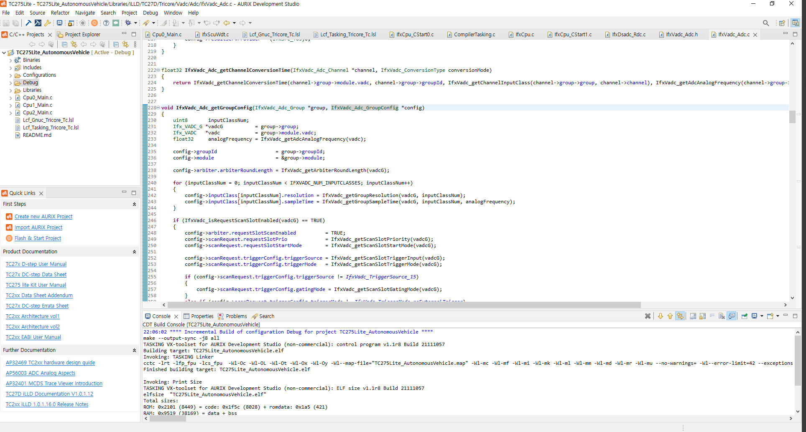

# AURIX Development Studio

ADS(AURIX Development Studio)는 인피니언에서 무료로 제공하는 Tricore-based AURIX microcontroller 계열 MCU를 위한 무료 IDE 툴이다.

 

* Eclipse IDE
* C-Compiler
* Multi-core Debugger 

 

해당 툴에는 위와 같은 기능이 내장되어 있다. 

[Tool DownLoad](https://www.infineon.com/cms/en/product/promopages/aurix-development-studio/?gad_source=1&gclid=Cj0KCQjwqdqvBhCPARIsANrmZhMY0IgjSlLoj3yQVoUJE6Ht9kYTliXhuKMqFmbxsDEWV488utc-bEkaAtXeEALw_wcB&gclsrc=aw.ds)

Tool Download 경로로 들어가면 ADS 설치를 위한 경로가 나오고 위 그림 상의 Download를 누르면 설치파일을 받을 수 있다. 

해당 툴을 설치하면 기본적으로 Eclipse Base의 IDE라는 것을 한 눈에 알 수 있다. 

