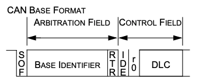
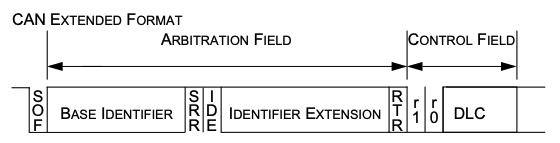
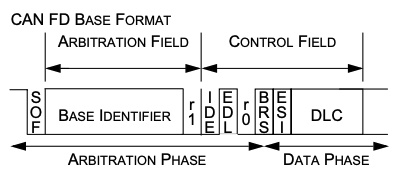
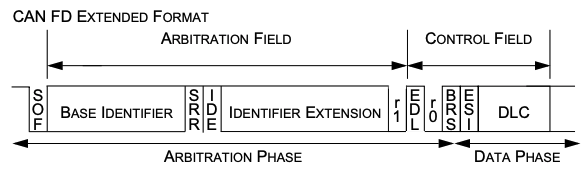

I2C is pronounced as "eye-squared-see" or "eye-two-see"

# 1. Prologue

Concept of I2C

# 1.1 Introduce I2C

> I2C 는 Philips Semicondoctors 에서 1982년에 개발된 통신 방식이다.

## 특징
|<b> I2C 회로도 구성 (출처 - 위키피디아) </b>|
|:--:|
||

I2C는 동기식, multi-contoller/multi-target(즉 multi master/slave)방식의 시리얼 통신 버스이다.
데이터 통신은 SDA(데이터 신호)와 SCL(클럭 신호) 두 라인을 사용하며, 총 7비트의 통신 주소 공간을 가지며, 이론상 112개의 노드를 동시 연결 할 수 있다.

<table>
  <tr>
    <th> Wires Used </th>
    <td> 2 </td>
  </tr>
  <tr>
    <th> Maximum speed </th>
    <td>  </td>
  </tr>
  <tr>
    <th> Standdard mode </th>
    <td> 100kbps </td>
  </tr>
  <tr>
    <th> Fast mode </th>
    <td> 400kbps </td>
  </tr>
  <tr>
    <th> High speed mode </th>
    <td> 3.4Mbps </td>
  </tr>
  <tr>
    <th> Ultra fast mode </th>
    <td> 5Mbps </td>
  </tr>
  <tr>
    <th> Max # of Masters </th>
    <td> Unlimited </td>
  </tr>
  <tr>
    <th> Max # of Slaves </th>
    <td> 1008 </td>
  </tr>
</table>

## 장/단점

I2C 통신 프로토콜은 아래와 같은 장/단점을 가진다.

### 장점

- SDA와 SCL 두 가닥의 선만으로 데이터 송수신이 가능함.
- 동기식 통신이므로 비 동기식 통신인 UART 등에 비해 안정적임.
- BUS 형태로 다수의 I2C Master과 다수의 I2C Slave 장치를 연결할 수 있음. (단 통신 클럭은 1개의 마스터 장치만 제공 가능함.)

### 단점

- 속도가 느림 (표준 모드 기준 100kbps) UART 대비 빠르지만 SPI 대비 느리기 때문에 애매한 선택지인 경우가 많음. 그러나 최근 Fast I2C의 경우 최대 5Mbps까지 지원하는 경우도 있음.
- 반이중 통신이기 때문에 한 노드에서 데이터를 보내는 중에는 나머지 노드에서 데이터를 보낼 수 없음.
- 제어 레지스터, 주소, 전송 플래그 등 다양한 부분을 고려해야 하기 때문에 사용하기 복잡할 수 있음.
- 선만 연결해주면 되는 다른 쉬운 통신 방식(CAN 등)에 비해 데이터 통신을 위해 별도의 회로를 구성해야 함. (풀업 저항 구성이 필요함)

상기와 같은 특성으로 인해 I2C는 아래와 같은 응용에서 주로 사용된다.

- 센서류
- OLED, LCD 제어
- DAC 및 ADC 장치 연결
- EEPROM 연결 

## 동작 구조

### Physical Layer
|<b> I2C Physical Layer (출처 - 위키피디아) </b>|
|:--:|
||

- 피지컬 레이어에서, SCL과 SDA 라인은 오픈 드레인(MOSFET) 혹은 오픈 컬렉터(BJT) 버스 설계로 각 라인마다 풀-업 저항이 필요함.
- Low는 Ground, High은 Floating하게(풀업 저항으로 인하여 High로) 하여 제엏 할 수 있음. (즉 직접적인 High 출력을 수행하지 않음) 이를 통해 낮은 전류로도 신호를 제어할 수 있음.
- 그러나 고속 통신을 할 경우, 빠른 rising edge를 생성하기 위해 풀-업 저항 대신 직접 전류를 인가하여 SCL 혹은 SCL과 SDA를 제어할 수 있음.
- 이렇게 Default high로 제어할 경우 여러 노드가 동시에 라인을 제어할 수 있다는 장점이 있음.
  
|<b> start stop comm (출처 - Analog Device) </b>|
|:--:|
||rev=bebf30881dea46a19f86abcbd41d2e0a
- No communication 상태일 경우 SCL과 SDA는 모두 High로 유지되며, 통신을 시작하기 위해서는 SDA를 Low로 바꾸면서 SCL은 High로 유지한 후 SCL을 Low로 천이 해야함.(다시 SDA가 High로 가는 경우는 없음.)
- 데이터 전송 중에는SDA는 SCL이 Low일때만 천이되어야 함

### 기본 통신 방식
|<b> I2C 통신 타이밍 (출처 - 위키피디아) </b>|
|:--:|
||
1. 우선 HW상 SDA와 SCL 모두 Rp(풀업 저항)을 이용해 Vdd(Vcc)에 연결하여 SDA SCL 회로를 High로 유지하도록 한다.(플로팅 방지)
2. SCL을 제공하는 마스터는 데이터를 전송할지 수신할지 결정한다. 이때 데이터를 송/수신할 때 반드시 슬레이브 주소를 마스터가 가지고 있어야 한다.
3. SDA와 SCL은 기본적으로 풀업저항에 의해 High 상태를 유지한다.
4. SCA가 low로 떨어지는 신호를 시작 신호 (S) 라고 판단 한다.
5. 이후 파란색 부분처럼 SCL이 Low로 떨어지는 시점이 SDA가 Bit 신호를 전환하는 시점이다.
6. 이후 SCL이 High가 되는 시점에 SDA의 High & Low 여부에 따라 데이터비트가 결정된다.
7. 모든 데이터를 수신한 후 SCL이 High로 유지된 후 SDA가 High로 변환되면 정지 신호로 판단하여 통신을 종료한다.

|<b> Master Slave 간 통신 시퀀스 (출처 - Digikey) </b>|
|:--:|
||

### Master to Slave (Write to Slave)

1. Master가 Slave에 데이터를 Write할 경우 시작 신호 S 이후 7비트의 Slave 주소를 Write 한다.
2. 이후 마지막 8번째 비트에 0을 Write한다.(마지막 bit가 0일 경우 Write 모드)
3. 이후 Slave가 데이터 수신을 할 준비가 완료되었다는 신호로 ACK 신호 (0)을 송신하면 Master은 8비트의 데이터를 송신하기 시작한다.
4. 매 8비트마다 Master로부터 데이터가 송신되면 Slave는 ACK 신호(0)를 보낸다.
5. 이후 데이터 전송이 전부 완료되면 마스터는 SCL을 High로 유지한 후 SDA를 High로 바꾼다.

### Slave to Master (Read from Slave)

1. Master가 Slave로부터 데이터를 Read 할 경우 시작 신호(S)이후 7비트의 Slave 주소를 Write 한다.
2. 이후 마지막 8번째 비트에 1을 Write 한다(마지막 bit가 1일 경우 Read 모드) 
3. 이후 Slave가 ACK 신호 (0)을 송신 후 데이터를 송신한다.
4. 매 8비트마다 Slave로부터 데이터가 송신되면 Master은 ACK 신호(0)를 보낸다.
5. 이후 데이터 전송이 전부 완료되면 마스터는 NACK(1)을 보낸 후 SCL를 Hgih로 유지 한 후 SDA를 High로 바꾼다.

## CAN Frame Types

### Data Frame
데이터를 전달하기 위한 메세지.

<table>
    <tr>
        <th>Bitfield</th>
        <th>Standard CAN</th>
        <th>Extended CAN</th>
    </tr>
    <tr>
        <td>Start Of Frame (SOF)</td>
        <td>
            1bit, bit "0" 
            메시지 프레임의 맨 앞에 위치함 
        </td>
        <td>Standard CAN 과 동일</td>
    </tr>
    <tr>
        <td rowspan="5">Arbitration Field</td>
        <td>ID (11-bit)</td>
        <td>Base ID (11-bit)</td>
    </tr>
    <tr>
        <td>
        RTR (1-bit), bit "0" 
        해당 메시지가 데이터 프레임이라는 것을 가리킴 
        - bit "1": 원격전송 요청(RTR : Remote Transmission Request)을 의미함.
        </td>
        <td>
        SSR (Substitute Remote Request, 1-bit) bit "1"
        </td>
    </tr>
    <tr>
        <td></td>
        <td>IDE (1-bit), bit "1"</td>
    </tr>
    <tr>
        <td></td>
        <td>Extended ID (18-bit)</td>
    </tr>
    <tr>
        <td></td>
        <td>
        RTR (1-bit), bit "0" 
        해당 메시지가 데이터 프레임이라는 것을 가리킴
        </td>
    </tr>
    <tr>
        <td rowspan="3">Control Field</td>
        <td>Reserved 1, bit "0"(IDE)</td>
        <td>Reserved 1, bit "0"</td>
    </tr>
    <tr>
        <td>Reserved 0, bit "0"</td>
        <td>Reserved 0, bit "0"</td>
    </tr>
    <tr>
        <td>Data Length Code (4-bit) 0~8 byte 전송 가능</td> 
        <td>Standard CAN 과 동일</td>
    </tr>
    <tr>
        <td>Data Field</td>
        <td colspan="3">
        한 노드로부터 다른 노드로 전하고자 하는 데이터를 포함함. 
        DLC에 맞는 길이로 구성됨
        </td>
    </tr>
    <tr>
        <td rowspan="2">CRC Field</td>
        <td>CRC Sequence(15-bit) 
        CRC polynomial = 0b_1100_0101_1001_1001
        </td>    
        <td>Standard CAN 과 동일</td>
    </tr>
    <tr>
        <td>CRC Delimiter (1-bit), bit "1"</td>
        <td>Standard CAN 과 동일</td>
    </tr>
    <tr>
        <td rowspan="2">ACKnowledge Field</td>
        <td>
        ACK Slot (1-bit), bit "0" 
        다른 노드가 메시지를 성공적으로 수신하면 bit "1"로 변경함
        </td>
        <td>Standard CAN 과 동일</td>
    </tr>
    <tr>
        <td>ACK delimiter(1-bit), bit "1"</td>
        <td>Standard CAN 과 동일</td>
    </tr>
    <tr>
        <td>End Of Frame Field (EOF)</td>
        <td>7-bit, 7bit 모두 "1"</td>
        <td>Standard CAN 과 동일</td>
    </tr>
</table>

Standard 와의 호환
1. Extended ID: Standard 와 호환을 위해 11+18 bit로 쪼개어 사용한다.
   - 앞 부분의 11bit ID가 같은 경우(Standard CAN 과 Extended CAN 이 충돌하는 경우) Extended CAN의 SSR 비트로 인해 Standard CAN이 항상 우선됨.
2. Standard Control Field의 R1과 같은 위치에 Extended Arbitration Field의 IDE가 존재한다.
   - 서로 반대 비트를 가짐. R1: bit "0", IDE: bit "1"

### Remote Frame

재전송을 요청하는 프레임이다. 

전체적으로 Data Frame과 비슷하지만 RTR 비트가 1이어야하고 데이터 필드가 없다.

### Error Frame

버스 에러를 감지했을때 사용한다.

모든 유닛이 전송할 수 있다.

<table>
    <tr>
        <th>Bitfield</th>
        <th>Standard CAN</th>
        <th>Extended CAN</th>
    </tr>
    <tr>
        <td>Error Flag</td>
        <td colspan="2">
Active Error: 6 consecutive 'dominant' bits 
Passive Error: 6 consecutive 'recessive' bits unless it is overwritten by ’dominant’ bits from other nodes. 
에러를 감지한 ’error active’ 스테이션은 active error flag를 전송한다. SOF부터 CRC까지 모든 필드에 적용되는 비트 스터핑을 위반해서 다른 스테이션에 알림. 
The PASSIVE ERROR FLAG is complete when these 6 equal bits have been detected.
        </td>
    </tr>
    <tr>
        <td>Error Delimeter</td>
        <td colspan="2">
        8 ’recessive’ bits 
ERROR FLAG 전송 후 각 스테이션은 'recessive' 비트를 전송하고 'recessive' 비트를 감지할 때까지 버스를 모니터링함. 그 후에는 7개의 'recessive' 비트를 더 전송하기 시작함
        </td>
    </tr>
</table>

### Overload Frame

프레임 사이에 추가 딜레이를 요청할때 사용한다.

<table>
    <tr>
        <th>Bitfield</th>
        <th>Standard CAN</th>
        <th>Extended CAN</th>
    </tr>
    <tr>
        <td>Overload Flag</td>
        <td colspan="2">
        6 ’dominant’ bits. Active Error 와 동일함
        </td>
    </tr>
    <tr>
        <td>Overload Delimeter</td>
        <td colspan="2">
        8 ’recessive’ bits. ERROR DELIMITER 와 동일함 
        OVERLOAD FLAG 전송 후 스테이션은 'dominant' 비트에서 'recessive' 비트로의 전환을 감지할 때까지 버스를 모니터링함. 
        이 시점에서 모든 버스 정류장은 OVERLOAD FLAG 전송을 완료하고 모든 정류장은 동시에 7개의 'recessive' 비트 전송을 시작함
        </td>
    </tr>
</table>

### Interframe Spacing

메세지 프레임을 구분하기 위한 장치
- Data Frame 및 Remote Frame은 interframe spacing을 통해 이전 프레임과 구분된다.
- Overload Frame 및 Error Frame은 해당 비트필드로 구분되지 않는다.

<table>
    <tr>
        <th>Bitfield</th>
        <th>Standard CAN</th>
        <th>Extended CAN</th>
    </tr>
    <tr>
        <td>Intermission</td>
        <td colspan="2">
        3 'recessive' bit 
        INTERMISSION 중에는 어떤 스테이션도 DATA FRAME 또는 REMOTE FRAME의 전송을 시작할 수 없음 
        OVERLOAD 조건을 알리는 것 외엔 아무것도 할 수 없음
        </td>
    </tr>
    <tr>
        <td>Bus Idle</td>
        <td colspan="2">
        BUS IDLE period는 임의의 길이일 수 있음 
        전송할 내용이 있는 모든 스테이션에서 버스에 액세스할 수 있음 
        다른 메시지 전송 중에 전송 보류 중인 메시지는 INTERMISSION 다음의 첫 번째 비트에서 시작됨 
        버스에서 'Dominant' 비트 감지는 프레임 시작으로 해석됨
        </td>
    </tr>
    <tr>
        <td>Suspend Transmission</td>
        <td colspan="2">
        'error passive' 스테이션의 경우에만 포함됨 
        'error passive' 스테이션은 메시지를 전송한 후 추가 메시지 전송을 시작하거나 버스가 Idle상태임을 인식하기 전에 INTERMISSION 다음에 8개의 'recessive' 비트를 보냄 
        그 동안 다른 스테이션에 의해 전송이 시작되면 스테이션은 이 메시지의 수신자가 됨
        </td>
    </tr>
</table>

해당 프레임이 끝나면 CAN 버스라인은 IDLE 상태로 인식된다.

## Other things related to CAN 2.0A

### Message Validation
메세지가 유효하다고 판단되는 시점
- 송신기: 보내는 메세지의 EOF가 끝날 때까지 오류가 없는 경우
- 수신기: 받는 메세지의 EOF가 마지막 1비트까지 오류가 없는 경우

### Coding
Data Frame과 Remote Frame의 SOF 부터 CRC Sequence 까지만 bit stuffing이 사용된다.
- bit stuffing: 연속되는 5개의 동일한 비트가 감지되면 자동으로 반대 비트를 섞어서 보내는 것.

비트스트림은 NRZ 방식으로 코딩된다.
- NRZ(Non Return to Zero): 한 비트를 표현할 때 전압을 계속 유지한다.
- RZ(Return to Zero): 한 클럭 내에서 데이터의 전압을 표현하고 다시 0으로 돌아간다.

출처 - 위키피디아

### Error Handling

**Error Detection**

1. Bit Error: 보낸 비트값이랑 버스에서 모니터링된 값이 다른 때
2. Stuff Error: 비트 스터핑이 잘못 되었을 때
3. CRC Error: 계산된 CRC 값과 수신된 결과가 다를 때
4. Form Error: 고정된 형식의 비트필드에 잘못된 비트가 포함된 때
5. Acknowledgment Error: ACK SLOT에서 수신기가 값을 바꾸지 않은 때

(+) 오류들은 같이 뜰 수 있음

**Error Signalling**

오류를 감지한 노드는 Error Flag를 전송한다.
- Error Active Node: Active Error Flag 전송
- Error Passive Node: Passive Error Flag 전송

### Fault Confinement

Fault Confinement 과 관련해서 송수신기는 아래 세 가지 상태 중에 있을 수 있다.

1. Error Active
   - 버스 통신에 참여할수 있음
   - 오류가 감지되면 Active Error Flag 전송함
2. Error Passive
   - 버스 통신에 참여할수 있음
   - 오류가 감지되면 Passive Error Flag 전송함
   - 플래그 전송후 추가 전송을 시작하기전 대기함
3. Bus Off
   - 버스에 어떤 영향도 미칠수 없음.

결함 제한을 위해 모든 버스 장치에 오류 횟수를 저장한다.
1. 전송 오류 횟수
2. 수신 오류 횟수

이러한 개수는 총 12개의 규칙에 따라 변경된다.
- 자세한 내용은 can 스펙 참조

## Other things related to CAN 2.0B

웬만한건 CAN 2.0 A와 겹치므로 Extended CAN에만 있는 내용을 추가했다.

### Message Filtering

전체 식별자를 기반으로 필터링된다
- 마스크 레지스터를 사용하여 연결된 수신 버퍼에 매핑할 식별자 그룹을 선택할 수 있다.
- 마스크 레지스터의 모든 비트는 프로그래밍 가능해야 한다. (메시지 필터링을 위해 활성화하거나 비활성화할 수 있다.)

# 1.2 Concerning CAN FD

CAN with Flexible Data-Rate

## 특징

CAN 2.0 프로토콜과 호환된다.
- ISO 11898-1에 따라 모든 CAN 메세지를 송수신 할 수 있음
- Data Link Layer, Physical Layer는 CAN 2.0 B 와 동일함

CAN 보다 빠르고 더 많은 비트를 전송할 수 있다.
- Classic CAN: 1 MBit/s, 8 Byte/Frame
- CAN FD:
  - Bit rate: Control Field의 BRS로 속도를 조절함
    - 1 MBit/s(Arbitration phase)
    - 8 MBit/s(Data Phase) 
  - DLC: 0~8 Bytes(CAN 호환) + 8~64 Bytes(추가)

프레임 형식이 추가 되었다.
- 4가지 프레임 형식(CAN or CANFD / BASE or EXTENDED)
   1. CAN BASE FORMAT: 11 bit long identifier and constant bit rate
   
   2. CAN EXTENDED FORMAT: 29 bit long identifier and constant bit rate
   
   3. CAN FD BASE FORMAT: 11 bit long identifier and dual bit rate
   
   4. CAN FD EXTENDED FORMAT: 29 bit long identifier and dual bit rate
   

CAN FD에는 Remote Frame이 없다.

# 1.3. Concerning CAN-based Protocols
## UDS on CAN

ISO 14229-3
- Road vehicles / Unified diagnostic services (UDS) / Part 3: Unified diagnostic services on CAN implementation (UDSonCAN)
- This document specifies an application profile for the implementation of unified diagnostic services (UDS) on controller area network (CAN) in road vehicles.
UDS on CAN references ISO 14229-1 and ISO 14229-2 and specifies implementation requirements of the diagnostic services to be used for diagnostic communication on CAN.
This document specifies
  - additional requirements specific to the implementation of UDS on the CAN network, and; 
  - specific restrictions in the implementation of UDS on the CAN network

ES 95486-02

etc..

## CCP/XCP

## Others
ISO-TP - ISO 15765-2(자동차 진단용 전송 프로토콜) 

EnergyBus - CiA 454 및 IEC 61851-3(배터리-충전기 통신)

SAE J1939(버스 및 트럭용 차량 내 네트워크)

SAE J2284(승용차용 차량 내 네트워크)

GMLAN - 제너럴 모터스(제너럴 모터스용)

# 1.4. Note on the car industry history 
CAN 이전 Mesh 형 토폴로지 사용
- GM사의 캐딜락

1986년 BOSCH, Automotive Serial Controller Area Network 개발
- 벤츠 요구
- 87년 Intel, CAN controller 출시
- 91년 MB CAN 적용 양산 차량(W140) 출시

1991년 CAN 2.0 발표
- part A 11 bit
- part B 29 bit

1993년 ISO CAN 표준 발표
- ISO 11898-1: Data link layer
- ISO 11898-2: 비내결함성 CAN physical layer(고속)
- ISO 11898-3: 내결함성을 위한 CAN physical layer(저속)
  - 11519-2
  - 95년 11898

1996년 OBD-II 표준 미국 의무화 
- 자동차, 경트럭 등

2001년 EOBD 표준 의무화(가솔린) 

2004년 EOBD 표준 의무화(디젤) 

2012년 Bosch CAN FD 1.0 발표 

2018년 CiA CAN XL 개발 시작

- 폭스바겐 요구

# 2. The First Journey

Communication with CAN

# 3. The Journey of the Nine Tools
1. DaVinci (Vector)
2. CANdb+ (Vector)
3. CANoe (Vector)
4. CANape (Vector)
5. INCA (ETAS)
6. TRACE32 (Vector)
7. mobilgene (HAE)
8. python scripting with CAN BUS Shield
9. etc..

# 4. The Treason of AUTOSAR 

AUTOSAR COM Stack
- CAN Driver
- CANIF
- CANTP
- PDUR
- COM
- CANSM
- CANNM
- IPDU
- DCM
- ComM
- and etc...

# 5. The Journey of the CAN bearers

?

# 6. The War of the CAN - Cyber Security For CAN

1. CAN Vulnerability 
2. 공격 방법
3. 방어 기법
   - E2E
   - CRC
   - SecOC

# 7. The End of the CAN Age 
Communication system after CAN

## 7.1 CAN XL
## 7.2 Flexlay
## 7.3 Ethernet

# 8. Appendix
## 8.1 Network Topology
1. Ring
2. Mesh
3. Star
4. Fully Connected 
5. Line
6. Tree
7. Bus

## 8.2. Other Communication in Vehicle
1. UART
2. SPI
3. LIN