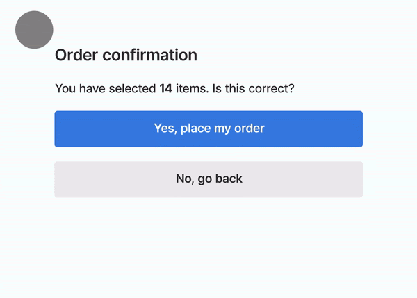

## 概要

Core Webvitals の指標の１つである、CLS の知識を整理するページ。

## CLS とは

ページを読み込んでから表示されるまでに「レイアウトのずれ」が生じること。
この現象をスコア化した指標が CLS。

CLS（Cumulative Layout Shift）は、ページが読み込まれたときに発生する予期しないレイアウトの変化を測定する指標。

これにより、ユーザーが意図せずにボタンやリンクをクリックしてしまうなどの不便を防ぐことができる。

CLS は、画面上の要素が突然移動することでユーザーエクスペリエンスを損なうことを防ぐために重要で、CLS のスコアが低いほど、視覚的に安定したページと評価される。

### サンプル

下記はページ読み込み後に、レイアウトが突然変わってしまい、キャンセルボタンが下にずれ注文が確定してしまうという悲しい例

[Cumulative Layout Shift（CLS） web.dev][1].

### 発生しうるパターン

ページ コンテンツの予期しない移動は、リソースが非同期で読み込まれたり、DOM 要素が既存のコンテンツよりも先にページに動的に追加された場合に発生する。

レイアウトがずれる原因としては、サイズが不明な画像や動画、元の代替サイズよりも大きくまたは小さく表示されるフォント、動的にサイズ変更されるサードパーティの広告やウィジェットなどがある。

## どのように測定しているのか

CLS は、ページの表示中に予期しないレイアウトの変化がどれだけ発生したかを評価します。これは、ページ全体のライフサイクルを通じて測定され、各レイアウトシフトごとにスコアが計算される。

### CLS の測定方法について

ラボ、フィールドデータのどちらでも計測でき、以下のツールで測定できる。

#### ラボ

[Chrome DevTools][3].

[Lighthouse][4].

[PageSpeed Insights][5].

[WebPageTest][6].

#### フィールド

[Chrome UX レポート][7].

[PageSpeed Insights][5].

[Search Console（Core Web Vitals レポート）][8].

[web-vitals （JavaScript ライブラリ）][9].

#### CLS 値をどのように計測すればよいか

基本的には、

1. フィールドデータの中から、適切なツールを選定し原因の大まかなあたりをつける
2. 開発環境で修正を行い、Lighthouse で計測し、改善されていることを確認する
3. リリース後、CLS のスコアが改善されていることを継続的に監視する

の繰り返しです。
ラボデータだけみて改善しきたっと勘違いしないように注意。ちゃんとフィールドデータ上でも確認すること。

### Tips

CLS のスコアについて

[Cumulative Layout Shift（CLS）レイアウトシフトのスコア web.dev][2].

[1]: https://web.dev/articles/cls?hl=ja
[2]: https://web.dev/articles/cls?hl=ja#layout-shifts-in-detail
[3]: https://developer.chrome.com/docs/devtools?hl=ja
[4]: https://developer.chrome.com/docs/lighthouse/overview?hl=ja
[5]: https://pagespeed.web.dev/?hl=ja
[6]: https://www.webpagetest.org/
[7]: https://developer.chrome.com/docs/crux?hl=ja
[8]: https://support.google.com/webmasters/answer/9205520?hl=ja
[9]: https://github.com/GoogleChrome/web-vitals
[10]: https://web.dev/articles/optimize-cls?hl=ja
