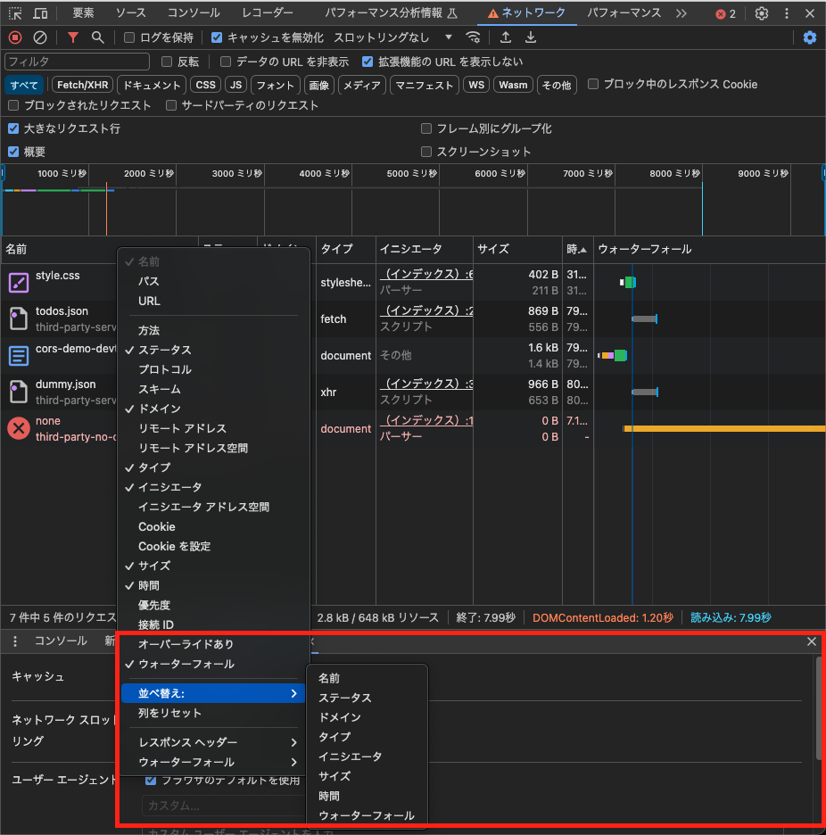
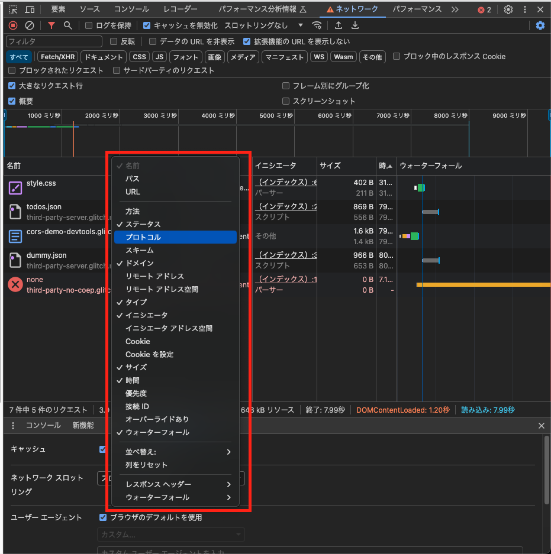
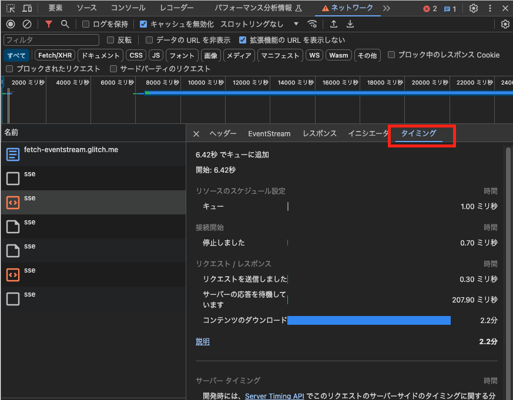
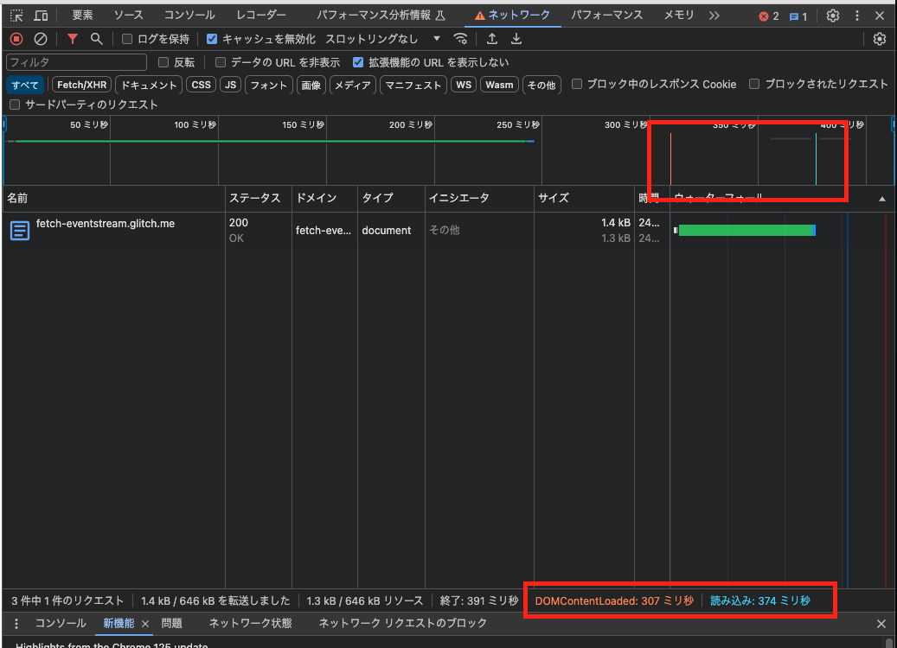

Chrome DevTools のネットワーク機能についてまとめられたリファレンスを読んで、初めて知った知識や気になったことを雑にメモしていく
https://developer.chrome.com/docs/devtools/network/reference?hl=ja

## 読み込み動作を変更する

### ブラウザキャッシュを無効にして初回訪問をエミュレートする

初めてアクセスするユーザのサイトをエミュレートするには、「Disable cache」チェックボックスをオンにする。
これにより、DevTools がブラウザキャッシュを無効にし、初めてのユーザエクスペリエンスを正確にエミュレートできるようになる。

## HTTP レスポンスヘッダーをオーバーライドする

レスポンスヘッダーのオーバーライドを使用すると、

- CORS ヘッダー
- Permissions-Policy ヘッダー
- クロスオリジン分離ヘッダー
  をローカルで確認することが出来る。詳細は下記。
  https://developer.chrome.com/docs/devtools/overrides?hl=ja#override-headers

## 拡張機能の URL を非表示にする

サイト上の資材にのみみたい場合は、Chrome にインストールした拡張機能から送信された無関係なリクエストを除外します。
拡張機能のリクエストの URL は chrome-extension:// で始まります。
拡張機能のリクエストを非表示にするには、[Hide extenstion URLs] チェックボックスをオンにします。

## リクエストを並び替える

「リクエスト」表の任意の列のヘッダーをクリックすると、その列でリクエストが並べ替えられます。

また、リクエストの並び替え方法を変更するには、リクエストテーブルのヘッダーを右クリックし、項目を追加します。

## リクエストのタイミングの詳細を表示する

リクエストのタイミングの詳細を表示するには、

1. 「Request」 テーブルの 「Name」 列で、リクエストの URL をクリックします。
2. 「Timing」 タブをクリックします。
   

### タイミングタブの詳細について

以下の通り。

- キュー。ブラウザは、接続の開始前と次のタイミングでリクエストをキューに入れます。
  - 優先度の高いリクエストがあります。
  - このオリジンに対してすでに開いている TCP 接続は 6 つで、上限に達しています。HTTP/1.0 と HTTP/1.1 にのみ適用されます。
  - ブラウザは、ディスク キャッシュの容量を短時間割り当てています。
- 停止。キューに記載されているいずれかの理由で、接続の開始後にリクエストが停滞することがあります。
- DNS ルックアップ。ブラウザがリクエストの IP アドレスを解決しています。
- 最初の接続。ブラウザが、TCP handshake や再試行などの接続を確立して SSL のネゴシエーションを行っている。
- プロキシ ネゴシエーション。ブラウザがプロキシ サーバーとリクエストをネゴシエートしている。
- リクエスト送信済み。リクエストを送信しています。
- ServiceWorker の準備ブラウザが Service Worker を起動しています。
- Service Worker へのリクエストリクエストは Service Worker に送信されています。
- 待機中（TTFB）。ブラウザはレスポンスの最初のバイトを待機しています。TTFB は Time To First Byte（最初のバイトまでの時間）です。この時間には、1 - 往復のレイテンシと、サーバーがレスポンスの準備にかかった時間が含まれます。
- コンテンツのダウンロード。ブラウザは、ネットワークから直接、または Service Worker からレスポンスを受信しています。
  この値は、レスポンス本文の読み取りにかかった合計時間です。
  想定よりも大きい場合は、ネットワークの速度が遅いか、ブラウザが他の処理を行っているためビジー状態でレスポンスが読み取られていないことを示している可能性があります。

## 読み込みイベントを表示する

DevTools では、「Network」パネルの複数の場所に、DOMContentLoaded イベントと load イベントのタイミングが表示されます。DOMContentLoaded イベントは青色、load イベントは赤色です。

