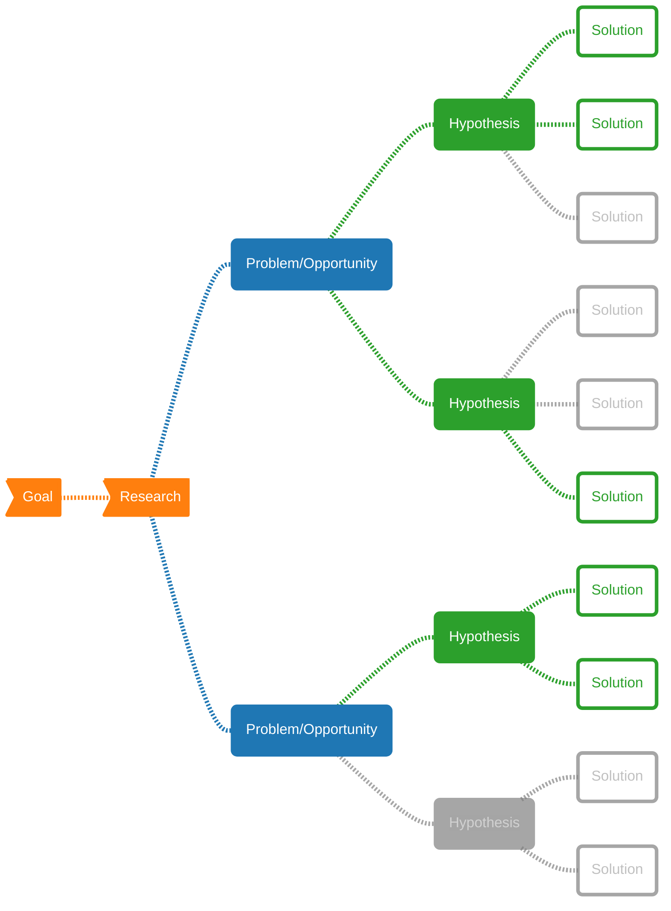

This document serves as a guide to experimental (A/B test) design, made for data scientists, data and ML engineers, and researchers. The goal is to present these concepts clearly and precisely, ensuring that readers can apply these principles to their own work in experimentation as I did.

The content is derived from the books [*Trustworthy Online Controlled Experiments: A Practical Guide to A/B Testing*](https://experimentguide.com/) by Kohavi et al. (2020), and [Design and Analysis of Experiments](https://www.wiley.com/en-br/Design+and+Analysis+of+Experiments%2C+10th+Edition-p-9781119492443) by Montgomery (2019). Additionally, it incorporates insights from various resources available on [Speero](https://speero.com/), [Confidence](https://confidence.spotify.com/docs), and [Optimizely](https://www.optimizely.com/).

<!-- prettier-ignore -->
> **Note:** This document combines content from these sources with my personal insights, workflows, and definitions developed while leading the experimentation program at a travel tech company in Brazil.
> 
> For a more comprehensive understanding, **I highly recommend reading the full books**.
{: .block-warning }

<!-- prettier-ignore -->
> **WIP - Update 28/06/24: chapter 2 written**
{: .block-danger }

- [Chapter 1: Introduction and Motivation](#chapter-1-introduction-and-motivation)
- [Chapter 2: Running and Analyzing Experiments: An End-to-End Example](#chapter-2-running-and-analyzing-experiments-an-end-to-end-example)
  - [2.1 Before the Experiment](#21-before-the-experiment)
  - [2.2 Setting up the Example](#22-setting-up-the-example)
  - [2.3 Hypothesis Testing: Establishing Statistical Significance](#23-hypothesis-testing-establishing-statistical-significance)
  - [2.4 Designing the Experiment](#24-designing-the-experiment)
  - [2.5 Running the Experiment and Getting Data](#25-running-the-experiment-and-getting-data)
  - [2.6 Interpreting the Results](#26-interpreting-the-results)
  - [2.7 From Results to Decisions](#27-from-results-to-decisions)
- [Chapter 3: Twyman's Law and Experimentation Trustworthiness](#chapter-3-twymans-law-and-experimentation-trustworthiness)
  - [3.1 Misinterpretation of the Statistical Results](#31-misinterpretation-of-the-statistical-results)
  - [3.2 Threats to Internal Validity](#32-threats-to-internal-validity)
  - [3.3 Threats to External Validity](#33-threats-to-external-validity)
  - [3.4 Segment Differences](#34-segment-differences)
  - [3.5 Simpson's Paradox](#35-simpsons-paradox)
- [Chapter 4: Experimentation Platform and Culture](#chapter-4-experimentation-platform-and-culture)

# Chapter 1: Introduction and Motivation
<!-- 
## 1.1 Notation and Nomenclature

In the context of this document, **an experiment refers to a systematic procedure where one or more factors are purposefully manipulated to observe their effect on a response variable**. The primary goal is to identify and quantify the differences in the response variable values across different conditions or treatments. For instance:

- **Experiment 1:** Nike, the athletic apparel company, is conducting an experiment with their mobile shopping interface to determine whether changing the user interface from a list view to a tile view will increase the proportion of customers proceeding to checkout.

- **Experiment 2:** Nixon, the watch and accessories brand, is testing four different video ad themes on Instagram. The themes include surfing, rock climbing, camping, and urban professional. The goal is to identify which ad theme is watched the longest on average.

**Metric of Interest**

The metric of interest (MOI) is the statistic that the experiment aims to investigate. Typically, **the objective is to optimize this metric**, either by maximizing or minimizing it. For example, key performance indicators (KPIs) in business, such as click-through rates (CTRs), bounce rate, average time on page, and 95th percentile page load time, are common metrics of interest. In the Nike example, the checkout rate (COR) serves as the metric of interest, while in the Nixon example, the average viewing duration is the key metric.

**Response Variable**  

The response variable, denoted $y$, is the primary variable of interest that needs to be measured to calculate the metric of interest. For instance, in the Nike example, the response variable is a binary indicator of whether a customer checked out. In the Nixon example, it is the continuous measurement of viewing duration for each user.

**Factor**  

A factor, denoted $x$, is a secondary variable of interest that may influence the response variable. Factors are also known as covariates, explanatory variates, predictors, features, or independent variables. In the Nike experiment, the factor is the visual layout, whereas in the Nixon experiment, the factor is the ad theme.

**Experimental Conditions and Levels**  

Experimental conditions refer to the unique combinations of levels of one or more factors, also known as treatments, variants, or buckets. Levels are the specific values that a factor can take in an experiment. For Nike, the levels are tile view and list view, while for Nixon, the levels are the four ad themes: surfing, rock climbing, camping, and urban professional.

**Experimental Units**  

Experimental units are the entities assigned to the experimental conditions and on which the response variable is measured. In the Nike example, the experimental units are Nike mobile customers, and in the Nixon example, they are Instagram users. It is important to note that in many online experiments, the experimental unit is often a user or customer, but this is not always the case. -->

<!-- prettier-ignore -->
> **WIP**
{: .block-danger }

# Chapter 2: Running and Analyzing Experiments: An End-to-End Example

## 2.1 Before the Experiment

Every experiment should aim to solve a problem or address an opportunity, and for that, we need to clearly state it. The definition of the problem sets the objectives of the experiment and lays the foundation for all subsequent steps. Recognizing and defining the problem often requires input from various stakeholders, including engineering, marketing, management, customers, and operating personnel. Usually, we want to ensure the problem originates from **research**.

<!-- prettier-ignore -->
> **Definition: Research**
>
> Research can include user testing or feedback, heat maps, session recordings, analytics, benchmark surveys, etc.
{: .block-tip }

From the research, we can start defining our **problem**.

<!-- prettier-ignore -->
> **Definition: Problem**
>
> The problem could be any bottleneck or friction identified during research. The problem statement should be clear and concise about the barriers encountered, sticking to facts and eliminating subjective opinions.
{: .block-tip }

From research, numerous problems or opportunities may arise. We should then generate ideas or hypotheses on how to solve those problems.

<!-- prettier-ignore -->
> **Definition: Hypothesis**
>
> A hypothesis is a statement about the parameters of a probability distribution or the parameters of a model for the data. The hypothesis reflects some conjecture about the problem.
{: .block-tip }

We can formulate hypothesis following the template:

    
    
A hypothesis template. <a href="https://optimiseordie.medium.com/hypothesis-kit-v4-4a1441f77ddc">Source</a>: Craig Sullivan's adaptation from Booking.com's template.

Based on the hypotheses, we develop solutions, or execution plans, to test them. A common framework to define problem and hypothesis is Spotify's [From Gut to Plan: The Thoughtful Execution Framework](https://spotify.design/article/from-gut-to-plan-the-thoughtful-execution-framework), which is roughly depicted in the diagram below:

## 2.2 Setting up the Example

In this chapter, we will consider a fictional online commerce site that sells widgets. The objective is to explore various changes, such as new features, UI updates, or backend modifications, to understand their impact on user behavior and business metrics.

- **Market Research:** Market research should be conducted to identify potential problems or opportunities within the current system. This can include user feedback, analytics, and other data sources to gain insights into user behavior and business performance.

- **Problem Definition:** Based on the research, define the specific problem to be addressed. For example, the research might reveal that users are abandoning the checkout process at a high rate.

- **Marketing Experiment:** The marketing department wants to test the effect of adding a coupon code field to the checkout page, hypothesizing that this will drop the rate of abandoning checkout. However, based on external data, there is concern that this change might negatively affect revenue by distracting customers during checkout.

- **Implementing the Test:** To evaluate this, a simple A/B test is designed. The test involves adding a non-functional (fake door) coupon code field to the checkout page, which will display an “Invalid Coupon Code" message when used. The goal is to measure whether the presence of this field impacts the completion of the purchase process and overall revenue.

## 2.3 Hypothesis Testing: Establishing Statistical Significance

The primary objective of an A/B test is to decide which condition is optimal with respect to a **metric of interest (MOI)**. This metric could be a mean (e.g., average time on page), a proportion (e.g., CTR, bounce rate), a variance, or a quantile (e.g., median page load time). Before designing, running, or analyzing our experiment, let's characterize the MOI with its:

- **Mean Value:** The [average](basic-stats#mean) of all observations in a data set.
- **Standard Error:** It's the [standard deviation](basic-stats#standard-deviation) of the [sampling distribution of the mean](basic-stats#sampling-distribution), which reflects how variable the estimate of our metric will be.

Knowing these values helps in sizing the experiment correctly and calculating **statistical significance** during analysis. The sensitivity, or ability to detect statistically significant differences, improves with lower standard errors of the mean. This can be achieved by increasing the number of users or extending the experiment duration. However, extending the duration of the experiment may not be as effective after a couple of weeks as unique user growth is sub-linear due to repeat users while some metrics themselves have a "growing" variance over time.

<!-- prettier-ignore -->
> **Definition: Statistical Significance**
>
> Statistical significance quantifies the probability that the results are not due to chance, given an uncertainty threshold.
{: .block-tip }

**Running Multiple Samples**

We conduct the experiment with many users using a method called replication. Replicating the test with a large number of users provides more meaningful results than testing with just a few users. We compare two groups of users to determine if the observed change is statistically significant:

- **Control Group:** Users experiencing the existing setup.
- **Treatment Group:** Users experiencing the new change.

Formally, we define a null hypothesis ($H_0$), which states that there is no difference between the control and treatment groups. The goal is to decide whether to reject the null hypothesis based on the observed data. This decision is made by computing a test statistic (in this context called a p-value), which indicates the probability of observing such a difference if the null hypothesis were true. If the p-value is less than the predefined **significance level $\alpha$**, we reject the null hypothesis, concluding that the experiment has a statistically significant effect.

<!-- prettier-ignore -->
> **Definition: Significance level**
>
> The significance level ($\alpha$) of a test is the probability of rejecting the null hypothesis when it is true, that is, having a false positive result. It determines how extreme the p-value must be to reject $H_0$. Common choices for $\alpha$ are 0.05 and 0.01.
{: .block-tip }

When defining $\alpha$ as 0.05 we're also defining the range the confidence interval ($1 - \alpha$) as 95%.

- **Confidence Interval:** A 95% confidence interval typically covers the true difference 95% of the time. It helps in assessing whether the observed effect is significant.

- **Statistical Power:** The probability of detecting a meaningful difference when there is one. Higher sample sizes generally yield higher power, typically aiming for 80-90%.

Beyond statistical significance, we need to consider practical significance, which measures the real-world impact of the change. For example, large companies like Google or Bing may find a 0.2% change significant, whereas startups might look for at least a 10% improvement. The goal is to set a practical significance threshold that reflects the business context.

## 2.4 Designing the Experiment

Designing an effective experiment involves making four key decisions:

1. **Randomization Unit**: Typically, the randomization unit is the user. However, in some cases, it might be more useful to consider sessions or even webpages as units.

    <!-- prettier-ignore -->
    > **Definition: Randomization**
    >
    > Randomization is the process of randomly assigning experimental subjects to one of the treatment groups. This ensures that potential influences, which cannot be controlled or determined by observation, are equally likely in all treatment groups, thereby eliminating bias.
    {: .block-tip }

    Randomization occurs at two levels: selecting experimental units for inclusion and assigning them to experimental conditions (treatment groups). The first level ensures that the sample is representative of the population, allowing for generalizable conclusions. The second level balances the effects of extraneous variables, making conditions more homogeneous and facilitating causal inference.

2. **Population Targeting:** While the experiment targets all users, it can be refined to specific user groups if necessary (e.g., users from a specific region, language, browser, demographics, etc.).

    When designing the experiment, it is useful to consider the online shopping process as a funnel. A customer start at the home page, browses through a few widgets, adds a widget to the cart, start the purchase process, and finally completes a purchase. To obtain meaningful results, we must target users who are at the relevant stage of the funnel—those who have started the checkout process. Including only potentially affected users helps eliminate noise and dilution from users who never reach the checkout stage.

    

    

        
        
A user online shopping funnel. Users may not progress linearly through a funnel, but instead skip, reapeat or go back-and-forth between steps. Source: Adapted from the Kohavi et al. (2020).

    

    
   

3. **Experiment Size**: To detect a small change, a larger experiment with more users is needed. The number of subjects in the test is directly related to the precision required to achieve a statistically significant result. We can think of this as a microscope; to detect smaller changes, we need a bigger microscope, thus, a larger sample size. To correctly determine how many samples we need for our experiment, we must conduct a power analysis.

4. **Experiment Duration**: The length of the experiment affects statistical power. A minimum of one week is recommended to capture variations like day-of-week effects. Additionally, we need to consider other types of seasonalities, such as holidays or major events, as well as primacy or novelty effects.

To summarize our design:

1. The randomization unit is a user.

2. We will target all users and analyze those who visit the checkout page.

3. To achieve 80% power to detect at least a 1% change in revenue-per-user, we will conduct a power analysis to determine the sample size.

4. This translates into running the experiment for a minimum of four days with a 34/33/33% split among Control, Treatment one, and Treatment two. We will run the experiment for a full week to ensure that we understand the day-of-week effect, and potentially longer if we detect novelty or primacy effects.

## 2.5 Running the Experiment and Getting Data

Necessary components for running an experiment include:

- **Instrumentation**: Collect logs and data on how users interact with your site and which experiments those interactions are associated with. (We'll explore this in more detail in Chapter 13.)

- **Infrastructure**: Set up the necessary infrastructure to configure and run the experiment, including variation assignment and experiment configuration. (We'll cover this further in Chapter 4.)

After running the experiment and gathering the logs data, the next steps are to process the data, compute the summary statistics, and visualize the results.

## 2.6 Interpreting the Results

Before diving into the analysis, we need to perform sanity checks. These checks involve examining *guardrail metrics* or *invariants* — metrics that should remain unchanged between the control and treatment groups. Two types of guardrail metrics are:

1. **Trust-Related Metrics:** These include ensuring that the control and treatment samples are sized according to the experiment configuration and that they have the same cache-hit rates.
2. **Organizational Metrics:** These include metrics such as latency, which should remain consistent across control and treatment groups.

If these sanity checks fail, it likely indicates an issue with the experiment design, infrastructure, or data processing.

**Results Analysis**

||Revenue-per-user, Treatment|Revenue-per-user, Control|Difference|p-value|Confidence Interval|
|:--|:--:|:--:|:--:|:--:|:--:|
|Treat. One vs Control| $3.12  | $3.21 | -$0.09 (-2.8%) | 0.0003 | [-4.3%, -1.3%]|
|Treat. Two vs Control| $2.96  | $3.21 | -$0.25 (-7.8%) | 1.5e-23 | [-9.3%, -6.3%]|

The p-values for both treatments are less than 0.05, so we reject the null hypothesis. This indicates that adding a coupon code field decreased revenue, as it distracted users from completing their purchases.

## 2.7 From Results to Decisions

The goal of A/B tests is to gather data to inform decision-making. This section emphasizes ensuring that results are repeatable and trustworthy. The decision-making process involves translating experimental results into actionable decisions, considering both measurement conclusions and broader contextual factors.

Key considerations include:

- **Trade-offs Between Metrics**: Sometimes different metrics show conflicting results, such as increased user engagement but decreased revenue. Decision-makers need to balance these trade-offs.
- **Cost of Launching the Change**: This includes both the initial build cost and ongoing maintenance. High costs require higher practical significance to justify changes.
- **Downside of Wrong Decisions**: Not all decisions carry equal risks. For instance, launching a change with no impact may have a lower cost than missing out on a beneficial change.

**Practical Significance Thresholds**

To better guide the decision, let's take a look at the results for 6 different tests:

    
    
Examples for understanding statistical and practical significance when making launch decisions. The practical significance boundary is draw as two blue dashed lines. The estimated difference for each example result is the black marker, together with its confidence interval. Source: Adapted from the Kohavi et al. (2020)

   

We can guide the decisions following the examples:

1. **Statistically and Practically Insignificant**: The change is not worth pursuing or needs more iteration.
2. **Statistically and Practically Significant**: An easy decision to launch.
3. **Statistically Significant but Not Practically Significant**: We are confident about the magnitude of the change, but it may not be sufficient to outweight other factors such as cost.
4. **Neutral Results**: Indicates insufficient power to draw strong conclusions; a follow-up test is recommended.
5. **Practically Significant but Not Statistically Significant**: Indicates potential impact, but more data is needed for confidence. It's suggested to increase the power of the test.
6. **Statistically Significant and Likely Practically Significant**: Suggests repeating the test with more power for confirmation, but launching may be reasonable.

The key takeaway is the importance of balancing statistical and practical significance in decision-making, being explicit about the factors considered, and using these thresholds to guide future decisions.

# Chapter 3: Twyman's Law and Experimentation Trustworthiness

<!-- prettier-ignore -->
> **WIP**
{: .block-danger }

## 3.1 Misinterpretation of the Statistical Results

- **Lack of Statistical Power:**
- **Misinterpreting p-values:**
- **Peeking at p-values:**
- **Multiple Hypothesis Tests:**
- **Confidence Intervals:**

## 3.2 Threats to Internal Validity

- **Violations of SUTVA:**
- **Survivorship Bias:**
- **Intention-to-Treat:**
- **Sample Ratio Mismatch (SRM):**
  - **Browser Redirects:**
  - **Lossy Instrumentation:**
  - **Residual or Carryover Effects:**
  - **Bad Hash Function for Randomization:**
  - **Triggering Impacted by Treatment:**
  - **Time-of-Day Effects:**
  - **Data Pipeline Impacted by Treatment:**

## 3.3 Threats to External Validity

- **Primacy Effects:**
- **Novelty Effects:**

**Detecting Primacy and Novelty Effects**

## 3.4 Segment Differences

- **Segmented View of a Metric:**
- **Segmented View of the Treatment Effect (Heterogeneous Treatment Effect):**
- **Analysis by Segments Impacted by Treatment Can Mislead:**

## 3.5 Simpson's Paradox

<!-- prettier-ignore -->
> **Encourage Healthy Skepticism**
>
> 
{: .block-tip }

# Chapter 4: Experimentation Platform and Culture

