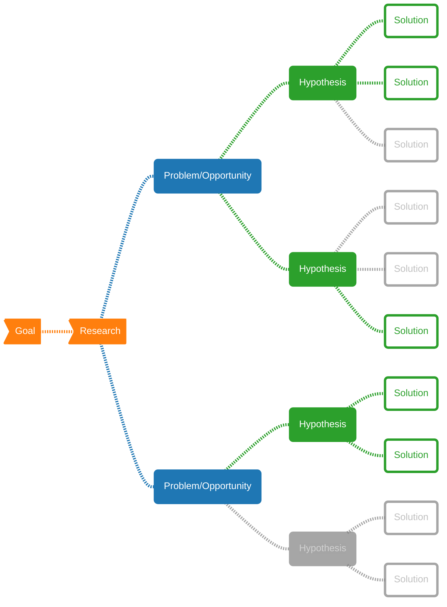
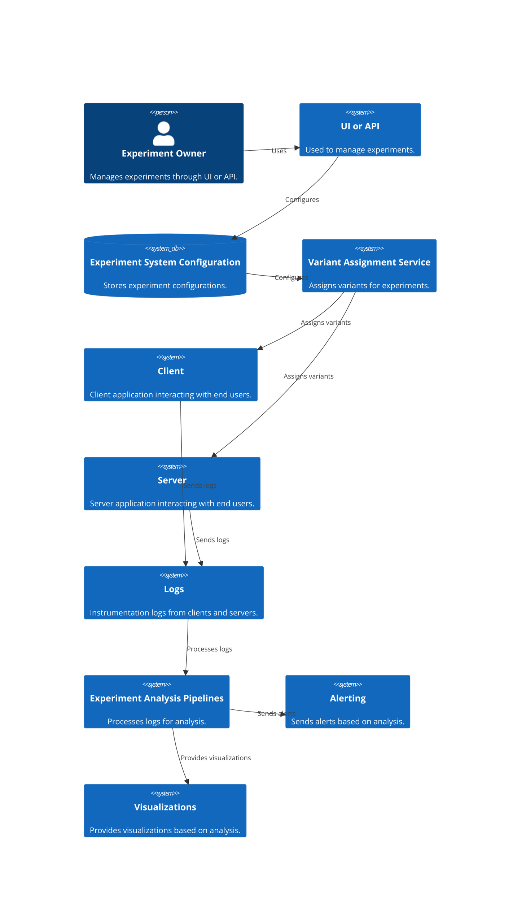

This document serves as a guide to experimental (A/B test) design, made for data scientists, data and ML engineers, and researchers. The goal is to present these concepts clearly and precisely, ensuring that readers can apply these principles to their own work in experimentation as I did.

The content is derived from the books [*Trustworthy Online Controlled Experiments: A Practical Guide to A/B Testing*](https://experimentguide.com/) by Kohavi et al. (2020), and [Design and Analysis of Experiments](https://www.wiley.com/en-br/Design+and+Analysis+of+Experiments%2C+10th+Edition-p-9781119492443) by Montgomery (2019). Additionally, it incorporates insights from various resources available on [Speero](https://speero.com/), [Confidence](https://confidence.spotify.com/docs), and [Optimizely](https://www.optimizely.com/).

<!-- prettier-ignore -->
> **Note:** This document combines content from these sources with my personal insights, workflows, and definitions developed while leading the experimentation program at a travel tech company in Brazil.
> 
> For a more comprehensive understanding, **I highly recommend reading the full books**.
{: .block-warning }

<!-- prettier-ignore -->
> **WIP - Update 28/06/24: chapter 2 written**
{: .block-danger }

{% include admonition.html type="abstract" title="Table of Contents" body="

- [Chapter 1: Introduction and Motivation](#chapter-1-introduction-and-motivation)
- [Chapter 2: Running and Analyzing Experiments: An End-to-End Example](#chapter-2-running-and-analyzing-experiments-an-end-to-end-example)
  - [2.1 Before the Experiment](#21-before-the-experiment)
  - [2.2 Setting up the Example](#22-setting-up-the-example)
  - [2.3 Hypothesis Testing: Establishing Statistical Significance](#23-hypothesis-testing-establishing-statistical-significance)
  - [2.4 Designing the Experiment](#24-designing-the-experiment)
  - [2.5 Running the Experiment and Getting Data](#25-running-the-experiment-and-getting-data)
  - [2.6 Interpreting the Results](#26-interpreting-the-results)
  - [2.7 From Results to Decisions](#27-from-results-to-decisions)
- [Chapter 3: Twyman's Law and Experimentation Trustworthiness](#chapter-3-twymans-law-and-experimentation-trustworthiness)
  - [3.1 Misinterpretation of the Statistical Results](#31-misinterpretation-of-the-statistical-results)
  - [3.2 Threats to Internal Validity](#32-threats-to-internal-validity)
  - [3.3 Threats to External Validity](#33-threats-to-external-validity)
  - [3.4 Segment Differences](#34-segment-differences)
  - [3.5 Simpson's Paradox](#35-simpsons-paradox)
- [Chapter 4: Experimentation Platform and Culture](#chapter-4-experimentation-platform-and-culture)
  - [4.1 Organizational Considerations](#41-organizational-considerations)
  - [4.2 Build vs. Buy](#42-build-vs-buy)
  - [4.3 Infrastructure and Tools](#43-infrastructure-and-tools)
    - [4.3.1 Experiment Definition, Set-up, and Management](#431-experiment-definition-set-up-and-management)
    - [4.3.2 Experiment Deployment](#432-experiment-deployment)
      - [Key Considerations for Experiment Deployment](#key-considerations-for-experiment-deployment)
      - [Experiment Instrumentation](#experiment-instrumentation)
      - [Importance of Measuring Impact](#importance-of-measuring-impact)

"%}

# Chapter 1: Introduction and Motivation
<!-- 
## 1.1 Notation and Nomenclature

In the context of this document, **an experiment refers to a systematic procedure where one or more factors are purposefully manipulated to observe their effect on a response variable**. The primary goal is to identify and quantify the differences in the response variable values across different conditions or treatments. For instance:

- **Experiment 1:** Nike, the athletic apparel company, is conducting an experiment with their mobile shopping interface to determine whether changing the user interface from a list view to a tile view will increase the proportion of customers proceeding to checkout.

- **Experiment 2:** Nixon, the watch and accessories brand, is testing four different video ad themes on Instagram. The themes include surfing, rock climbing, camping, and urban professional. The goal is to identify which ad theme is watched the longest on average.

**Metric of Interest**

The metric of interest (MOI) is the statistic that the experiment aims to investigate. Typically, **the objective is to optimize this metric**, either by maximizing or minimizing it. For example, key performance indicators (KPIs) in business, such as click-through rates (CTRs), bounce rate, average time on page, and 95th percentile page load time, are common metrics of interest. In the Nike example, the checkout rate (COR) serves as the metric of interest, while in the Nixon example, the average viewing duration is the key metric.

**Response Variable**  

The response variable, denoted $y$, is the primary variable of interest that needs to be measured to calculate the metric of interest. For instance, in the Nike example, the response variable is a binary indicator of whether a customer checked out. In the Nixon example, it is the continuous measurement of viewing duration for each user.

**Factor**  

A factor, denoted $x$, is a secondary variable of interest that may influence the response variable. Factors are also known as covariates, explanatory variates, predictors, features, or independent variables. In the Nike experiment, the factor is the visual layout, whereas in the Nixon experiment, the factor is the ad theme.

**Experimental Conditions and Levels**  

Experimental conditions refer to the unique combinations of levels of one or more factors, also known as treatments, variants, or buckets. Levels are the specific values that a factor can take in an experiment. For Nike, the levels are tile view and list view, while for Nixon, the levels are the four ad themes: surfing, rock climbing, camping, and urban professional.

**Experimental Units**  

Experimental units are the entities assigned to the experimental conditions and on which the response variable is measured. In the Nike example, the experimental units are Nike mobile customers, and in the Nixon example, they are Instagram users. It is important to note that in many online experiments, the experimental unit is often a user or customer, but this is not always the case. -->

<!-- prettier-ignore -->
> **WIP**
{: .block-danger }

# Chapter 2: Running and Analyzing Experiments: An End-to-End Example

## 2.1 Before the Experiment

Every experiment should aim to solve a problem or address an opportunity, and for that, we need to clearly state it. The definition of the problem sets the objectives of the experiment and lays the foundation for all subsequent steps. Recognizing and defining the problem often requires input from various stakeholders, including engineering, marketing, management, customers, and operating personnel. Usually, we want to ensure the problem originates from **research**.

<!-- prettier-ignore -->
> **Definition: Research**
>
> Research can include user testing or feedback, heat maps, session recordings, analytics, benchmark surveys, etc.
{: .block-tip }

From the research, we can start defining our **problem**.

<!-- prettier-ignore -->
> **Definition: Problem**
>
> The problem could be any bottleneck or friction identified during research. The problem statement should be clear and concise about the barriers encountered, sticking to facts and eliminating subjective opinions.
{: .block-tip }

From research, numerous problems or opportunities may arise. We should then generate ideas or hypotheses on how to solve those problems.

<!-- prettier-ignore -->
> **Definition: Hypothesis**
>
> A hypothesis is a statement about the parameters of a probability distribution or the parameters of a model for the data. The hypothesis reflects some conjecture about the problem.
{: .block-tip }

We can formulate hypothesis following the template:

    
    
A hypothesis template. <a href="https://optimiseordie.medium.com/hypothesis-kit-v4-4a1441f77ddc">Source</a>: Craig Sullivan's adaptation from Booking.com's template.

Based on the hypotheses, we develop solutions, or execution plans, to test them. A common framework to define problem and hypothesis is Spotify's [From Gut to Plan: The Thoughtful Execution Framework](https://spotify.design/article/from-gut-to-plan-the-thoughtful-execution-framework), which is roughly depicted in the diagram below:

## 2.2 Setting up the Example

In this chapter, we will consider a fictional online commerce site that sells widgets. The objective is to explore various changes, such as new features, UI updates, or backend modifications, to understand their impact on user behavior and business metrics.

- **Market Research:** Market research should be conducted to identify potential problems or opportunities within the current system. This can include user feedback, analytics, and other data sources to gain insights into user behavior and business performance.

- **Problem Definition:** Based on the research, define the specific problem to be addressed. For example, the research might reveal that users are abandoning the checkout process at a high rate.

- **Marketing Experiment:** The marketing department wants to test the effect of adding a coupon code field to the checkout page, hypothesizing that this will drop the rate of abandoning checkout. However, based on external data, there is concern that this change might negatively affect revenue by distracting customers during checkout.

- **Implementing the Test:** To evaluate this, a simple A/B test is designed. The test involves adding a non-functional (fake door) coupon code field to the checkout page, which will display an “Invalid Coupon Code" message when used. The goal is to measure whether the presence of this field impacts the completion of the purchase process and overall revenue.

## 2.3 Hypothesis Testing: Establishing Statistical Significance

The primary objective of an A/B test is to decide which condition is optimal with respect to a **metric of interest (MOI)**. This metric could be a mean (e.g., average time on page), a proportion (e.g., CTR, bounce rate), a variance, or a quantile (e.g., median page load time). Before designing, running, or analyzing our experiment, let's characterize the MOI with its:

- **Mean Value:** The [average](basic-stats#mean) of all observations in a data set.
- **Standard Error:** It's the [standard deviation](basic-stats#standard-deviation) of the [sampling distribution of the mean](basic-stats#sampling-distribution), which reflects how variable the estimate of our metric will be.

Knowing these values helps in sizing the experiment correctly and calculating **statistical significance** during analysis. The sensitivity, or ability to detect statistically significant differences, improves with lower standard errors of the mean. This can be achieved by increasing the number of users or extending the experiment duration. However, extending the duration of the experiment may not be as effective after a couple of weeks as unique user growth is sub-linear due to repeat users while some metrics themselves have a "growing" variance over time.

<!-- prettier-ignore -->
> **Definition: Statistical Significance**
>
> Statistical significance quantifies the probability that the results are not due to chance, given an uncertainty threshold.
{: .block-tip }

**Running Multiple Samples**

We conduct the experiment with many users using a method called replication. Replicating the test with a large number of users provides more meaningful results than testing with just a few users. We compare two groups of users to determine if the observed change is statistically significant:

- **Control Group:** Users experiencing the existing setup.
- **Treatment Group:** Users experiencing the new change.

Formally, we define a null hypothesis ($H_0$), which states that there is no difference between the control and treatment groups. The goal is to decide whether to reject the null hypothesis based on the observed data. This decision is made by computing a test statistic (in this context called a p-value), which indicates the probability of observing such a difference if the null hypothesis were true. If the p-value is less than the predefined **significance level $\alpha$**, we reject the null hypothesis, concluding that the experiment has a statistically significant effect.

<!-- prettier-ignore -->
> **Definition: Significance level**
>
> The significance level ($\alpha$) of a test is the probability of rejecting the null hypothesis when it is true, that is, having a false positive result. It determines how extreme the p-value must be to reject $H_0$. Common choices for $\alpha$ are 0.05 and 0.01.
{: .block-tip }

When defining $\alpha$ as 0.05 we're also defining the range the confidence interval ($1 - \alpha$) as 95%.

- **Confidence Interval:** A 95% confidence interval typically covers the true difference 95% of the time. It helps in assessing whether the observed effect is significant.

- **Statistical Power:** The probability of detecting a meaningful difference when there is one. Higher sample sizes generally yield higher power, typically aiming for 80-90%.

Beyond statistical significance, we need to consider practical significance, which measures the real-world impact of the change. For example, large companies like Google or Bing may find a 0.2% change significant, whereas startups might look for at least a 10% improvement. The goal is to set a practical significance threshold that reflects the business context.

## 2.4 Designing the Experiment

Designing an effective experiment involves making four key decisions:

1. **Randomization Unit**: Typically, the randomization unit is the user. However, in some cases, it might be more useful to consider sessions or even webpages as units.

    <!-- prettier-ignore -->
    > **Definition: Randomization**
    >
    > Randomization is the process of randomly assigning experimental subjects to one of the treatment groups. This ensures that potential influences, which cannot be controlled or determined by observation, are equally likely in all treatment groups, thereby eliminating bias.
    {: .block-tip }

    Randomization occurs at two levels: selecting experimental units for inclusion and assigning them to experimental conditions (treatment groups). The first level ensures that the sample is representative of the population, allowing for generalizable conclusions. The second level balances the effects of extraneous variables, making conditions more homogeneous and facilitating causal inference.

2. **Population Targeting:** While the experiment targets all users, it can be refined to specific user groups if necessary (e.g., users from a specific region, language, browser, demographics, etc.).

    When designing the experiment, it is useful to consider the online shopping process as a funnel. A customer start at the home page, browses through a few widgets, adds a widget to the cart, start the purchase process, and finally completes a purchase. To obtain meaningful results, we must target users who are at the relevant stage of the funnel—those who have started the checkout process. Including only potentially affected users helps eliminate noise and dilution from users who never reach the checkout stage.

    

    

        
        
A user online shopping funnel. Users may not progress linearly through a funnel, but instead skip, reapeat or go back-and-forth between steps. Source: Adapted from the Kohavi et al. (2020).

    

    
   

3. **Experiment Size**: To detect a small change, a larger experiment with more users is needed. The number of subjects in the test is directly related to the precision required to achieve a statistically significant result. We can think of this as a microscope; to detect smaller changes, we need a bigger microscope, thus, a larger sample size. To correctly determine how many samples we need for our experiment, we must conduct a power analysis.

4. **Experiment Duration**: The length of the experiment affects statistical power. A minimum of one week is recommended to capture variations like day-of-week effects. Additionally, we need to consider other types of seasonalities, such as holidays or major events, as well as primacy or novelty effects.

To summarize our design:

1. The randomization unit is a user.

2. We will target all users and analyze those who visit the checkout page.

3. To achieve 80% power to detect at least a 1% change in revenue-per-user, we will conduct a power analysis to determine the sample size.

4. This translates into running the experiment for a minimum of four days with a 34/33/33% split among Control, Treatment one, and Treatment two. We will run the experiment for a full week to ensure that we understand the day-of-week effect, and potentially longer if we detect novelty or primacy effects.

## 2.5 Running the Experiment and Getting Data

Necessary components for running an experiment include:

- **Instrumentation**: Collect logs and data on how users interact with your site and which experiments those interactions are associated with. (We'll explore this in more detail in Chapter 13.)

- **Infrastructure**: Set up the necessary infrastructure to configure and run the experiment, including variation assignment and experiment configuration. (We'll cover this further in Chapter 4.)

After running the experiment and gathering the logs data, the next steps are to process the data, compute the summary statistics, and visualize the results.

## 2.6 Interpreting the Results

Before diving into the analysis, we need to perform sanity checks. These checks involve examining *guardrail metrics* or *invariants* — metrics that should remain unchanged between the control and treatment groups. Two types of guardrail metrics are:

1. **Trust-Related Metrics:** These include ensuring that the control and treatment samples are sized according to the experiment configuration and that they have the same cache-hit rates.
2. **Organizational Metrics:** These include metrics such as latency, which should remain consistent across control and treatment groups.

If these sanity checks fail, it likely indicates an issue with the experiment design, infrastructure, or data processing.

**Results Analysis**

||Revenue-per-user, Treatment|Revenue-per-user, Control|Difference|p-value|Confidence Interval|
|:--|:--:|:--:|:--:|:--:|:--:|
|Treat. One vs Control| $3.12  | $3.21 | -$0.09 (-2.8%) | 0.0003 | [-4.3%, -1.3%]|
|Treat. Two vs Control| $2.96  | $3.21 | -$0.25 (-7.8%) | 1.5e-23 | [-9.3%, -6.3%]|

The p-values for both treatments are less than 0.05, so we reject the null hypothesis. This indicates that adding a coupon code field decreased revenue, as it distracted users from completing their purchases.

## 2.7 From Results to Decisions

The goal of A/B tests is to gather data to inform decision-making. This section emphasizes ensuring that results are repeatable and trustworthy. The decision-making process involves translating experimental results into actionable decisions, considering both measurement conclusions and broader contextual factors.

Key considerations include:

- **Trade-offs Between Metrics**: Sometimes different metrics show conflicting results, such as increased user engagement but decreased revenue. Decision-makers need to balance these trade-offs.
- **Cost of Launching the Change**: This includes both the initial build cost and ongoing maintenance. High costs require higher practical significance to justify changes.
- **Downside of Wrong Decisions**: Not all decisions carry equal risks. For instance, launching a change with no impact may have a lower cost than missing out on a beneficial change.

**Practical Significance Thresholds**

To better guide the decision, let's take a look at the results for 6 different tests:

    
    
Examples for understanding statistical and practical significance when making launch decisions. The practical significance boundary is draw as two blue dashed lines. The estimated difference for each example result is the black marker, together with its confidence interval. Source: Adapted from the Kohavi et al. (2020)

   

We can guide the decisions following the examples:

1. **Statistically and Practically Insignificant**: The change is not worth pursuing or needs more iteration.
2. **Statistically and Practically Significant**: An easy decision to launch.
3. **Statistically Significant but Not Practically Significant**: We are confident about the magnitude of the change, but it may not be sufficient to outweight other factors such as cost.
4. **Neutral Results**: Indicates insufficient power to draw strong conclusions; a follow-up test is recommended.
5. **Practically Significant but Not Statistically Significant**: Indicates potential impact, but more data is needed for confidence. It's suggested to increase the power of the test.
6. **Statistically Significant and Likely Practically Significant**: Suggests repeating the test with more power for confirmation, but launching may be reasonable.

The key takeaway is the importance of balancing statistical and practical significance in decision-making, being explicit about the factors considered, and using these thresholds to guide future decisions.

# Chapter 3: Twyman's Law and Experimentation Trustworthiness

<!-- prettier-ignore -->
> **WIP**
{: .block-danger }

## 3.1 Misinterpretation of the Statistical Results

- **Lack of Statistical Power:**
- **Misinterpreting p-values:**
- **Peeking at p-values:**
- **Multiple Hypothesis Tests:**
- **Confidence Intervals:**

## 3.2 Threats to Internal Validity

- **Violations of SUTVA:**
- **Survivorship Bias:**
- **Intention-to-Treat:**
- **Sample Ratio Mismatch (SRM):**
  - **Browser Redirects:**
  - **Lossy Instrumentation:**
  - **Residual or Carryover Effects:**
  - **Bad Hash Function for Randomization:**
  - **Triggering Impacted by Treatment:**
  - **Time-of-Day Effects:**
  - **Data Pipeline Impacted by Treatment:**

## 3.3 Threats to External Validity

- **Primacy Effects:**
- **Novelty Effects:**

**Detecting Primacy and Novelty Effects**

## 3.4 Segment Differences

- **Segmented View of a Metric:**
- **Segmented View of the Treatment Effect (Heterogeneous Treatment Effect):**
- **Analysis by Segments Impacted by Treatment Can Mislead:**

## 3.5 Simpson's Paradox

<!-- prettier-ignore -->
> **Encourage Healthy Skepticism**
>
> 
{: .block-tip }

# Chapter 4: Experimentation Platform and Culture

This chapter focuses on building a robust and trustworthy experimentation platform, and fostering a culture that supports continuous and effective experimentation.

**Experimentation Maturity Models**

Experimentation maturity models outline the phases organizations typically go through when adopting experimentation:

1. **Crawl**: Establish foundational prerequisites such as basic data science capabilities and instrumentation. Run a few experiments to build momentum.
2. **Walk**: Shift focus to defining standard metrics and running more experiments. Improve trust by validating instrumentation and running A/A tests.
3. **Run**: Scale experimentation efforts and codify metrics that capture trade-offs between multiple metrics. The organization uses experimentation to evaluate most new features and changes.
4. **Fly**: Conduct A/B experiments for nearly every change. Automation supports the scale of experiments, and institutional memory captures learnings.

A rough rule of thumb for organizations in the "Crawl" phase is running experiments approximately once a month (~10/year), increasing by 4-5x for each phase. In Walk phase the frequency is approximately once a week (~50/year), Run is daily (~250/year), and fly is when you reach thousand(s)/year.

## 4.1 Organizational Considerations
Key organizational considerations include leadership buy-in, processes, and training. The focus should be on creating a culture that embraces experimentation and uses data to inform decisions. Leaders play a crucial role by providing the necessary incentives, processes, and empowerment for the organization to make data-driven decisions.

**Leadership**

Leadership buy-in is critical for embedding A/B testing into the product development process. Leaders need to engage in:

- **Establishing shared goals**, agreeing on the high-level goal metrics and guardrail metrics;
- **Agreeing on key metrics** instead of number of features shipped;
- **Empowering teams to innovate**, expecting ideas to be evaluated and for many of them to fail;
- **Establishing a culture of failing fast**.

They must support:

- **Proper instrumentation** and **High data quality**;
- **Enforce standards** for interpreting results and giving transparency to how those results affect decision-making;
- A **portfolio of high-risk/high-rewards projects** relative to more incremental gain projects;
- **Long-term learning from experiments**, measuring impact and assessing return-on-investment (ROI) for various initiatives;
- **Agility**, with short release cycles to create a healthy, quick feedback loop for experimentation.

**Process**

Establishing educational processes and cultural norms is necessary to ensure trustworthy results. Education ensures that everyone has the basic understanding needed to design and execute trustworthy experiments and interpret the results correctly. Cultural norms help set an expectation of innovation, celebrating surprising failures, and fostering a continuous learning mindset.

To support this, organizations may establish just-in-time processes during experiment design and analysis. For example, Google used a checklist reviewed by experts to ensure that experiments were sufficiently powered and correctly designed. As experimenters gain experience, they become more independent and faster at running experiments, requiring less guidance.

Regular meetings for experiment reviews can provide additional just-in-time education, where experts examine the results, discuss instrumentation issues, and broaden the understanding of goals, guardrails, quality, and debug metrics. These discussions can also help anticipate issues during the development lifecycle and establish metric trade-offs.

**Sharing Learnings and Institutional Memory**

Through the platform or processes, we can share learning from experiments broadly, be it the meta-learning from experts observing many experiments or the learning gained from a single experiment. Organizations can share learnings through regular **newsletters**, curated **homepages**, or **social networks** attached to the experimentation platform (as is done at Booking.com). Institutional memory becomes increasingly important in later phases of maturity, helping to share and retain knowledge from past experiments.

For experimentation to succeed and scale, there must also be a culture around intellectual integrity — the learning matters most, not the results or whether we ship the change. Key practices to achieve full transparency include:

- **Computing Many Metrics**: Ensure important metrics are highly visible and cannot be cherry-picked when sharing results.
- **Newsletters and Meta-Analyses**: Share surprising results and conduct meta-analyses to build institutional knowledge.
- **Transparency and Intellectual Integrity**: Ensure full transparency on the experiment impact and make it difficult to launch treatments that negatively impact important metrics.
- **Embracing Failures**: Learn from failed ideas to improve future experiments.

## 4.2 Build vs. Buy

Organizations must decide whether to build their own experimentation platform or purchase an external solution. This decision can significantly impact the scalability, flexibility, and effectiveness of the experimentation process. Here are the key considerations when making that decision:

**Can an External Platform Provide the Functionality You Need?**

1. **Types of Experiments**:
    - Different types of experiments may have specific requirements, such as frontend vs. backend, server vs. client, or mobile vs. web.
    - Some external solutions may not be versatile enough to cover all types of experiments. For instance, JavaScript-based solutions might not work well for backend experiments or may slow down page loads.

2. **Website Speed**:
    - External solutions that require additional JavaScript can slow down page loads, impacting user engagement and experience.

3. **Metrics and Dimensions**:
    - Consider the range of metrics you want to use. External platforms may have limitations on the metrics that can be computed.
    - Metrics like percentiles, which are sensitive to latency, may not be well-supported. Consistency in metrics is crucial for broad business reporting.

4. **Randomization Unit and Data Sharing**:
    - Decide on the randomization unit (e.g., user, session) and the extent of data sharing required.
    - Ensure user privacy is respected and that there are no significant restrictions on what information can be shared with external platforms.

5. **Data Access and Integration**:
    - Assess if data logged to the external party is easily accessible and whether it can be integrated with additional sources of data.
    - Consider if real-time results are necessary for your experiments and whether the external platform supports this feature.

6. **Institutional Memory and Feature Implementation**:
    - Evaluate if the platform supports building institutional memory by retaining experiment results and learnings.
    - Check if the platform allows implementing features in their final version or if they need re-implementation post-experiment.

**What Would the Cost Be to Build Your Own?**

Building a scalable system is both challenging and expensive, as we'll see in our discussion on the technical platform issues later in this chapter. Key cost considerations include:

1. **Initial Investment**:
    - Building an internal platform requires a high initial investment in development and infrastructure.
    - Consider the time and resources needed to build and maintain the platform.

2. **Long-term Scalability**:
    - An internal platform can be tailored to specific organizational needs and can scale as the organization grows.
    - External solutions may offer faster implementation but could become limiting as experimentation needs evolve.

3. **Maintenance and Updates**:
    - Building your own platform requires ongoing maintenance and updates to keep up with new experimentation requirements and technological advancements.
    - External vendors typically handle maintenance and updates, but this can come at the cost of less customization.

**What's the Trajectory of Your Experimentation Needs?**

1. **Anticipation of Growth**:
    - Consider how many experiments your organization will run if it fully embraces experimentation.
    - If the momentum and demand for experimentation are high, the volume may grow beyond what an external solution can accommodate.

**Do You Need to Integrate into Your System's Configuration and Deployment Methods?**

1. **Integration with Deployment Methods**:
    - Experimentation should be integrated with continuous deployment processes.
    - If integration with existing deployment methods is complex, an internal solution might be more suitable.

Weigh the costs and benefits of building vs. buying based on the specific needs and long-term goals of the organization. Assess the impact on ROI and the ability to demonstrate the value of experimentation to stakeholders.

## 4.3 Infrastructure and Tools

Building a reliable experimentation platform involves more than just accelerating innovation. It ensures the trustworthiness of results for decision-making. Scaling experimentation at a company includes developing the infrastructure, tools, and processes that integrate deeply into the company’s culture and decision-making processes.

The main goal is to make experimentation self-service and minimize the incremental costs of running experiments. An effective experimentation platform must cover every step from designing and deploying experiments to analyzing results:

1. **Experiment Definition, Setup, and Management**: Tools to define, set up, and manage experiments via a user interface (UI) or API and store in the experiment system configuration.

2. **Experiment Deployment**: Both server- and client-side, that covers variant assignment and parametrization.

3. **Experiment Instrumentation**

4. **Experiment Analysis**: Tools for defining and computing metrics, and conducting statistical tests.

### 4.3.1 Experiment Definition, Set-up, and Management

To define, or specify, an experiment, we need:
- An owner;
- A name;
- A description;
- Start and end dates;
- And several other fields (see Chapter 12).

The platform also needs to

### 4.3.2 Experiment Deployment

- **Variant Assignment**: Determines which experiment variant a user is exposed to, based on user attributes and a random hash function to ensure consistency.
- **Production Code and Parameters**: Ensures that users receive the appropriate experience based on variant assignment, managing system parameters accordingly.

There are three main architectures for managing variant assignment:
1. **Code Forks Based on Variant Assignment**: Simple but can lead to technical debt.
2. **Parameterized System**: Reduces code debt but requires managing parameters.
3. **Centralized Configuration**: Optimizes performance by handling variant assignment early.

#### Key Considerations for Experiment Deployment
- Ensure atomicity in deploying experiments to avoid user experience inconsistencies.
- Determine the right point in the flow for variant assignment based on available information.
- Decide whether to allow multiple points of assignment based on the complexity of the platform.

#### Experiment Instrumentation
Proper instrumentation involves:
- Automating the assignment of experiment IDs, variants, and iterations.
- Validating experiment specifications to prevent configuration conflicts.
- Monitoring the status of experiments and allowing authorized individuals to start/stop them.

#### Importance of Measuring Impact
Regardless of the chosen architecture, it’s crucial to measure the cost and impact of running experiments, considering factors like site speed latency, CPU utilization, and machine cost.

In summary, a robust experimentation platform requires careful planning and implementation of infrastructure, tools, and processes that support the entire experimentation lifecycle from design to analysis. This integration ensures reliable and scalable experimentation practices within an organization.